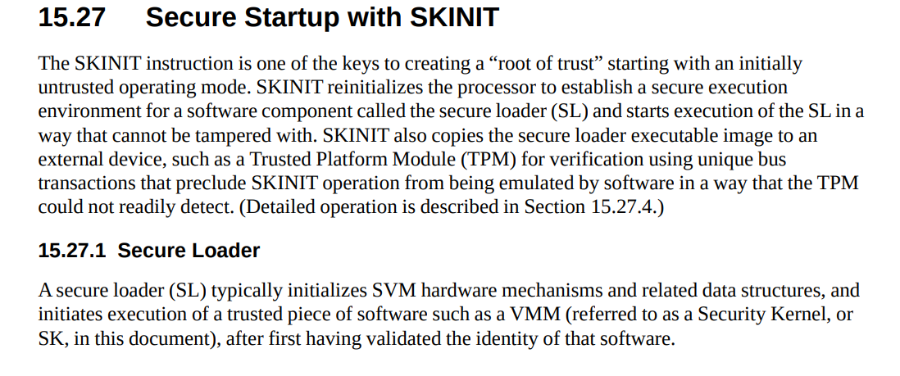
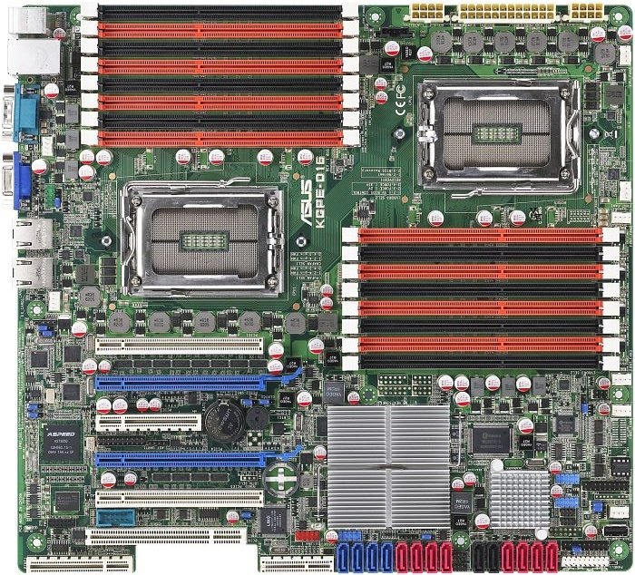
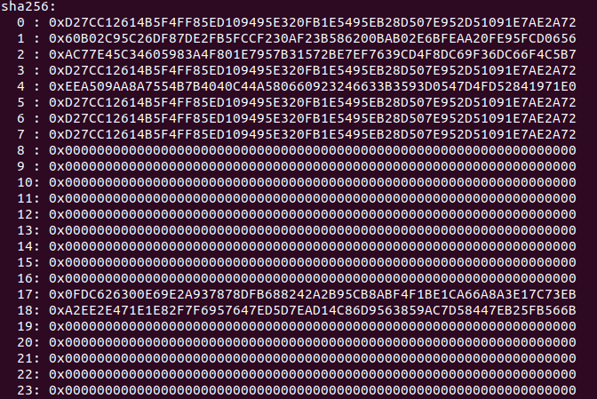
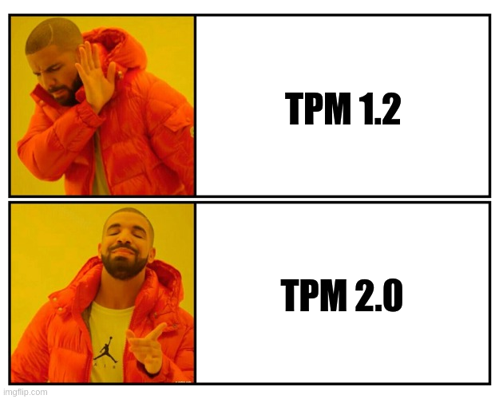
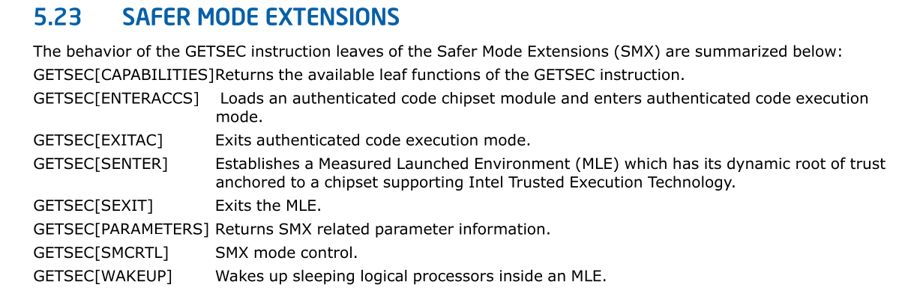
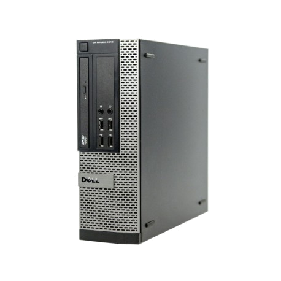
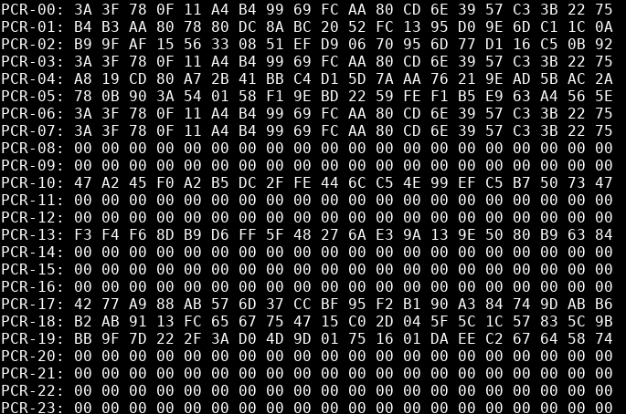
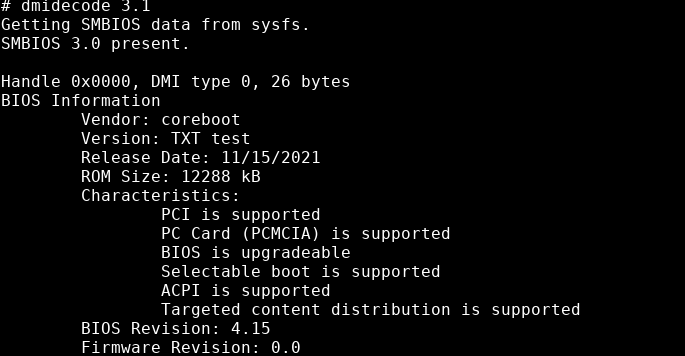

class: center, middle, intro

# DRTM as a modern Root of Trust in OSF

### Linux Secure Launch - TrenchBoot Summit 2021

## Michał Żygowski

---

# `whoami`

.center[]
.center[Michał Żygowski] .center[_Firmware Engineer_] .right-column50[

- Braswell SoC, PC Engines and Protectli maintainer in coreboot
- OpenPOWER System Software Workgroup chair
- 4 years in Open Source Firmware
- interested in advanced hardware and firmware security features

] .left-column50[

- <a href="https://twitter.com/_miczyg_"> @\_miczyg\_</a>

- <a href="mailto:michal.zygowski@3mdeb.com">
  michal.zygowski@3mdeb.com</a>

- <a href="https://www.linkedin.com/in/miczyg">
  linkedin.com/in/miczyg</a>

- <a href="https://www.facebook.com/miczyg1395">
  facebook.com/miczyg1395</a>

]

---

# About us

.center[.image-15[]
.image-15[]
.image-15[]
.image-15[]]
.center[.image-35[]]

- coreboot licensed service providers since 2016 and leadership participants
- UEFI Adopters since 2018
- Yocto Participants and Embedded Linux experts since 2019
- Official consultants for Linux Foundation fwupd/LVFS project
- IBM OpenPOWER Foundation members

---

# Agenda

- SRTM vs DRTM
- DRTM for AMD
- DRTM on Asus KGPE-D16
- Demo TrenchBoot
- DRTM for Intel
- DRTM on Dell OptiPlex 9010
- Demo Trusted Boot
- Demo TrenchBoot
- Intel TXT coreboot configuration
- Summary

---

# SRTM vs DRTM

.left-column50[

## .center[SRTM]

.center[.image-95[]] ] .right-column50[

## .center[DRTM]

.center[.image-95[]] ]

.footnote[ Sources:  https://twitter.com/Syzyf_/photo
https://userscontent2.emaze.com/images/229a72d7-5345-48c5-bc2e-7d1210a051b6/981a371ae2051b72d7901a00b94e9575.jpg
]

???

Imagine the size of the rock is the TCB. With SRTM you start with the reset
vector (the foot of the mountain) and you have to push it to the peak (e.g. the
kernel where finally SRTM may be used for attestation for example). The higher
the heavier he rock becomes. DRTM TCB is orders of magnitude smaller and
resembles a small rock which fits in a pocket. Further more if one wants to
reestablish the trust, you don't have to reboot the platform and start pushing
the rock from the mountain's foot, you can simply pick another small rock and
take it with you.

---

# DRTM for AMD

- implemented with an SVM (Secure Virtual Machine) instruction called SKINIT
- SKINIT instruction takes a 64KB Secure Loader Block (SLB) address in the EAX
  architectural register of the register
- everything is well documented in the AMD Architecture's Programmer Manual
  (except the bits to disable SLB protection on Zen+ CPUs)

.center[.image-90[]]

---

# DRTM for AMD

.center[.image-90[]]

???

- [Secure Kernel Loader (SKL)](https://github.com/TrenchBoot/secure-kernel-loader)
  is TrenchBoot's open implementation of AMD SLB
- SLB is responsible to measure the software to be securely launch which gives
  freedom of the protocol implementation
- SKINIT instruction available on every AMD processor (probably since SVM
  introduction), no need for high end CPU as in case of Intel CPUs
- SKINIT requires discrete LPC TPM in order to work properly

---

# DRTM on Asus KGPE-D16

.center[.image-40[]]

- KGPE-16 - Dual AMD G34 socket server/workstation board from Asus release in
  2010
- [FSF RYF](https://ryf.fsf.org/) certified hardware with open source firmware
  implementation in [coreboot](https://coreboot.org/) and
  libreboot(https://libreboot.org/)
- Good and quite cheap hardware to test TrenchBoot SKL on a server platform

---

# DRTM on Asus KGPE-D16

- Currently dropped from coreboot master branch, but thanks to
  [Immunefi](https://immunefi.com/) the platform is undergoing revival process
- 3mdeb will manage binary releases under
  [Dasharo](https://docs.dasharo.com/variants/asus_kgpe_d16/releases/) trademark
  providing validated and signed deliverables that can be used out of the box by
  end users.

.center[.image-60[]]

---

# KGPE-D16 TPM

- At the time of platform release, only TPM 1.2 was supported
- but with open source firmware we can make TPM 2.0 possible
- LPC TPM 1.2 and TPM 2.0 are compatible from the SKINIT perspective

.center[.image-60[]]

---

# Demo

.center[.image-40[]]

- it occurs the platform support code in coreboot 4.11 branch has issues with
  TPM cycles decoding
- hopefully we can fix that with the Dasharo firmware
- for those interested in AMD DRTM here is the recording of SKINIT on PC Engines
  apu2: https://asciinema.org/a/371576?cols=96&rows=24

---

# DRTM on Intel

- implemented with a set of SMX (Safer Mode Extensions) instructions called
  GETSEC
- GETSEC uses Authenticated Code Module (ACM), binary blobs signed by Intel to
  initialize Intel Trusted Execution Technology, in short TXT (Intel DRTM
  technology)
- [initial coreboot implementation](https://review.coreboot.org/c/coreboot/+/37016/)
  done by 9elements and tested on OCP Wedge100s and Facebook Watson

.center[.image-90[]]

---

# DRTM on Intel

.center[.image-80[]]

???

- there are two types of ACMs - BIOS and SINIT, the former are confidential and
  not distributable, the latter can be downloaded from Intel
- BIOS ACM is used to initialize the TXT during BIOS execution, unlocks the
  memory controller before memory initialization, clear the secrets in the
  memory if any are present

---

# DRTM on Intel

.center[.image-99[]]

???

- when the RAM is up it is time to properly initialize CPUs and setup TXT
  environment
- the firmware initializes the heap containing various platform specific
  information about the TXT
- yest another time ACM is launched to lock the TXT space and configuration
  before SINIT ACM will take over

---

# DRTM on Intel

.center[.image-99[]]

???

- requires a lot of preparation to execute an ACM via GETSEC instructions
  (memory type range registers set to tightly cover the ACM, cleared machine
  check error registers)
- SINIT establishes the Root of Trust and measures the software to be securely
  launched
- there is not much control on how SINIT executes and how software is measured

---

# DRTM On Dell OptiPlex 7010/9010

.center[.image-30[]]

- Dell OptiPLex 7010/9010 - a workstation with 3rd generation Intel Core
  processors and Intel Q77 TXT-capable chipset
- Also needs TXT capable CPU to use Intel TXT, that is only high-end i5 and i7
  processors have the TXT capability
- Cheap workstation for home and office use with coreboot open source firmware
  ported by 3mdeb

---

# DRTM On Dell OptiPlex 7010/9010

- coreboot-based Dasharo firmware for this machine will also be released as
  validated and signed binary with 3mdeb support for ends users
- 3rd generation processors have fully open silicon initialization in coreboot
- we are bound to TPM1.2 because the ACMs do not support TPM 2.0

.left-column50[ .center[.image-99[]] ] .right-column50[
.center[.image-99[]] ]

---

# Demo Trusted Boot

.center[ <a href="https://asciinema.org/a/449387?cols=96&rows=24"
target="_blank"> \
</a> ]

.footnote[ https://asciinema.org/a/449387?cols=96&rows=24 ]

---

# Demo TrenchBoot

.center[.image-40[]]

- GRUB with TrenchBoot slaunch module does not support TPM 1.2 for Intel TXT yet

---

# coreboot configuration

.center[ <a href="https://asciinema.org/a/449501" target="_blank"> \ </a> ]

.footnote[ https://asciinema.org/a/449501 ]

---

# Intel vs AMD comparison

.pure-table.pure-table-bordered.pure-table-striped[

|                                   AMD                                    |                                                       Intel                                                       |
| :----------------------------------------------------------------------: | :---------------------------------------------------------------------------------------------------------------: |
|                            no blobs required                             | BIOS and SINIT ACM blobs required, the former requires NDA, distribution of the latter is under clickthrough EULA |
|             BIOS doesn't need to do any DRTM initialization              |                                     complex BIOS initialization of Intel TXT                                      |
|                      possible to use any TPM family                      |                                     TPM family support dependent on the ACMs                                      |
| SKINIT available on all processors since introduction of the instruction |                      Intel TXT available only on high-end i5 and i7 CPUs and most Xeon CPUs                       |

]

Wishlist:

- reproducible binary builds of all Intel-signed ACMs, with read-only source
  code available outside Intel)

---

# TrenchBoot test matrix

.pure-table.pure-table-bordered.pure-table-striped[

|                                Tested devices                                | TPM family | Test result |            Notes            |
| :--------------------------------------------------------------------------: | :--------: | :---------: | :-------------------------: |
|                           Intel Tiger Lake client                            |  TPM 2.0   |    PASS     |        UEFI firmware        |
|                            Intel Kaby Lake server                            |  TPM 2.0   |    PASS     |        UEFI firmware        |
|                             Intel Skylake sever                              |  TPM 2.0   |    PASS     |        UEFI firmware        |
| PC Engines APU2 platform series  (AMD family 16h models 30h-3fh embedded) |  TPM 2.0   |    PASS     |      coreboot firmware      |
| PC Engines APU2 platform series  (AMD family 16h models 30h-3fh embedded) |  TPM 1.2   |    PASS     |      coreboot firmware      |
|       Asus KGPE-D16  (AMD Opteron family 15h models 00h-0fh server)       |  TPM 2.0   |    FAIL     | coreboot firmware TPM issue |
|          Supermicro M11SDV-8CT  (AMD EPYC 3000 Snowy Owl server)          |  TPM 2.0   |    PASS     |         legacy boot         |
|          Supermicro M11SDV-8CT  (AMD EPYC 3000 Snowy Owl server)          |  TPM 2.0   |    FAIL     |          UEFI boot          |

]

---

# Summary

- DRTM simplifies establishing the Root of Trust for Measurement and is order of
  magnitude less complex than SRTM (at least on AMD)
- TrenchBoot allows to integrate DRTM secure launch to any Intel machine with
  TPM 2.0 and proper BIOS support and any AMD machine (with discrete TPM, AMD
  fTPM is know to not work due to lack of localities)
- TPM 1.2 support for Intel TXT is still underway
- Ideal solution when you do not trust the BIOS
- Can be troublesome in UEFI environments due to the presence of Runtime
  Services and System Management Mode (although it can be containerized to
  restrict the SMM privileges)
