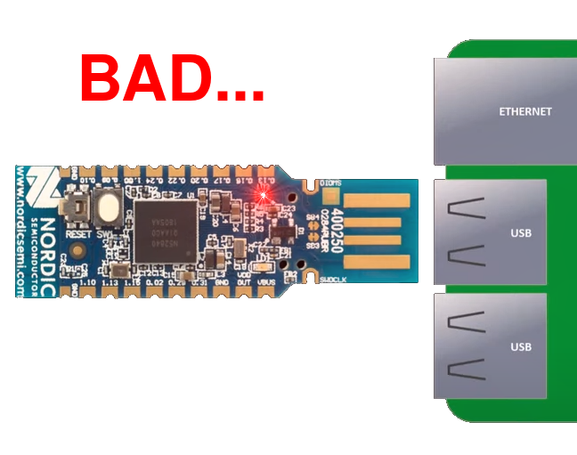
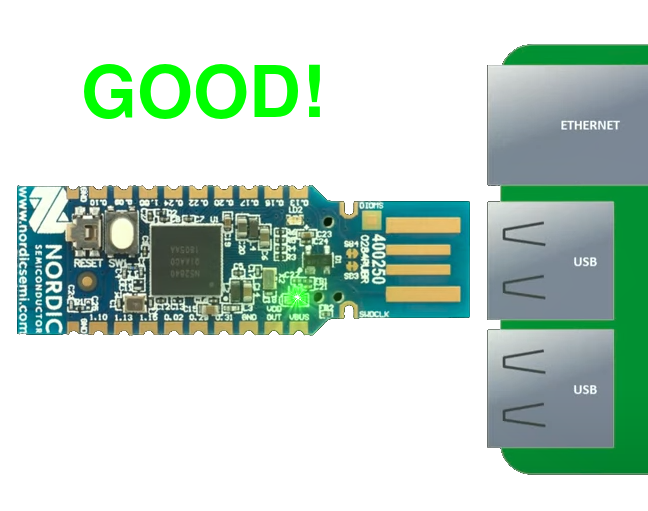
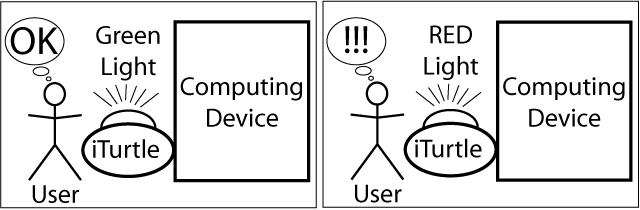
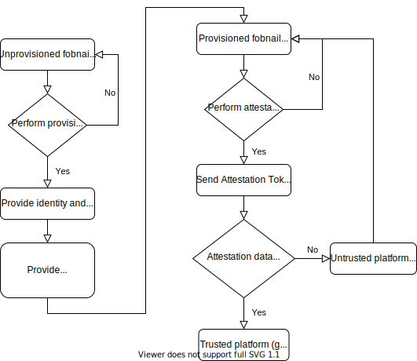
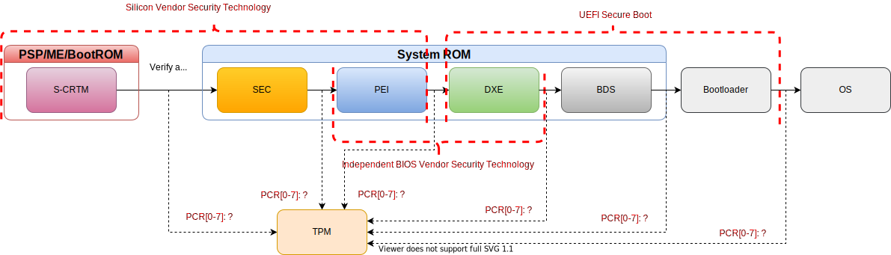
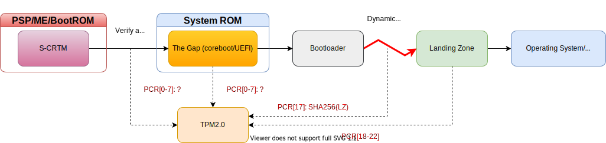
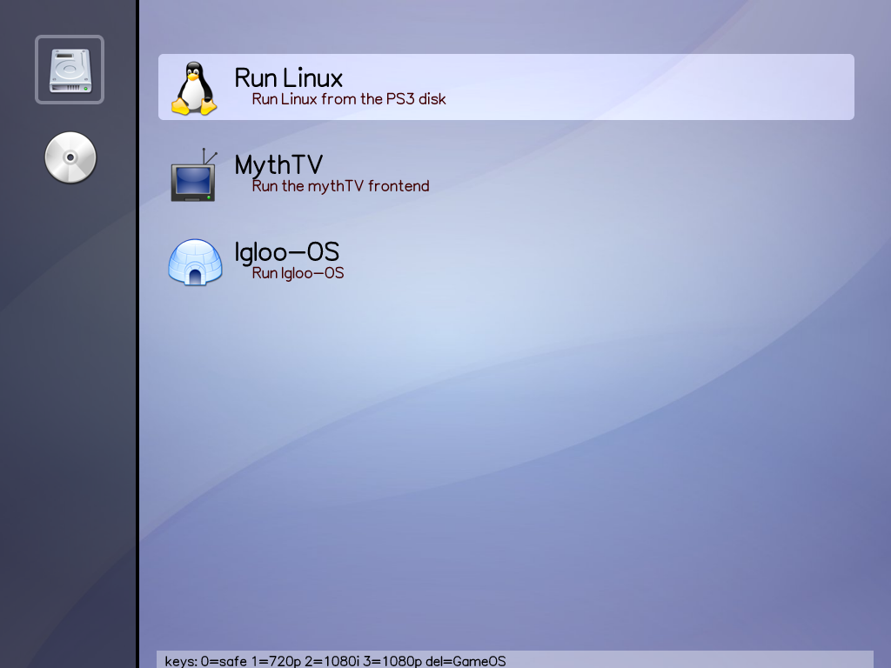
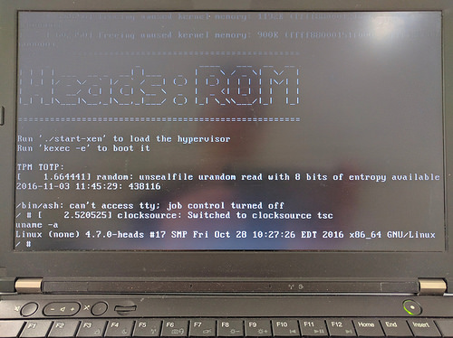
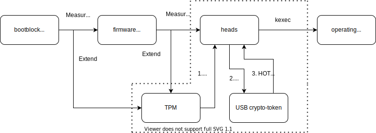

class: center, middle, intro

# Fobnail: Attestation in Your Pocket

### Linux Secure Launch - TrenchBoot Summit 2021

## Piotr Król

---

# `whoami`

.center[]

.center[Piotr Król] .center[_3mdeb Founder_] .right-column50[

- 13yrs in business
- 7yrs in Open Source Firmware and Trusted Computing integration
- C-level positions in 
  .image-30[]
  .image-30[]
  .image-30[]
  ] .left-column50[
- OSF and OSHW promoter interested in Trusted Computing
- Conference speaker and organizer
- TrenchBoot Steering Committee Core Member ]

---

# About us

.center[.image-15[]
.image-15[]
.image-15[]
.image-15[]]
.center[.image-35[]]

- coreboot licensed service providers since 2016 and leadership participants
- UEFI Adopters since 2018
- Yocto Participants and Embedded Linux experts since 2019
- Official consultants for Linux Foundation fwupd/LVFS project
- IBM OpenPOWER Foundation members

---

# Kudos

- Michał Żygowski, Firmware Engineer @ 3mdeb, as main contributor this
  presentation
- Artur Kowalski, Junior Embedded Firmware Engineer @ 3mdeb, as main contributor
  this presentation
- Maciej Pijanowski, Engineering Manager @ 3mdeb

---

# What is Fobnail?

.center[.image-30[]]

- NLNet Foundation granted project
- Reference OSF for OSHW USB token enabling a user/administrator for a
  user/administrator/enterprise to determine the integrity of a system.
- Fobnail improve trustworthiness of integrity checks by leveraging D-RTM
  effectively attesting Dynamically Launched Measured Environments (DLME),
  locally, over USB.

---

# Fobnail use case

### .center[Provide axiomatically trustworthy device\[[1]\] and simple user interface to attest platform state]

.left-column50[ .image-90[.center[]] ]
.right-column50[ .image-90[.center[]] ]

[1]:
  https://www.usenix.org/legacy/event/hotsec07/tech/full_papers/mccune/mccune_html/index.html

---

# This not new concept

.center[.image-60[]]

- The Fobnail project aims to provide a reference architecture for building
  offline integrity measurement servers on the USB device and clients running in
  Dynamically Launched Measured Environments (DLME)
  + In short it would be attestation server on USB token capable of attesting
    D-RTM payload
  + this is not new concept in principle, it was already announced by Jonathan
    McCune (Flicker author) at HotSec07 with the name iTurtle
- Project website: https://fobnail.3mdeb.com

.footnote[iTurtle:
https://www.usenix.org/legacy/event/hotsec07/tech/full_papers/mccune/mccune_html/index.html]

---

# Fobnail features

- open-source implementation of the iTurtle security architecture concept
  \[[1]\]
- compliance with IETF RATS (Remote ATtestation procedureS) \[[2]\]
- based on Reference Interaction Model for Challenge-Response-based Remote
  Attestation (CHARRA) \[[3]\]
- attest platform integrity in the early launch but also runtime
- sophisticated attestation policies
- multiple RIMs (Reference Integrity Measurements) to support attestation of
  multiple devices
- offline remote attestation

[1]:
  https://www.usenix.org/legacy/event/hotsec07/tech/full_papers/mccune/mccune_html/index.html
[2]: https://datatracker.ietf.org/doc/draft-ietf-rats-architecture/
[3]: https://github.com/Fraunhofer-SIT/charra

---

# Fobnail usage

.image-70[.center[]]

---

# S-RTM vs D-RTM "holy war": S-RTM

- as good as code making initial measurement
- vendor specific and closed technologies (NXP HAB, Intel Secure Boot/Boot
  Guard, AMD HVB) to protect S-CRTM implementation implies NDAs and proprietary
  tool chain
- S-CRTM protection is hard to establish and maintain properly (more then 20
  keys and certificates involved)
- well-established in oligopolistic SV+IBV environment
- lack of standardization around measurement reporting and event log
  transparency
- requires platform reset to establish trusted state
- lack of firmware supply chain transparency makes it hard to update
  (re-evaluation of PCR values, forward sealing)
- above issues leads to very slow adoption, complexity and mistakes while
  provisioning security features
- there are open implementations based on coreboot, vboot (Chromebook, PC
  Engines) and SPI NOR flash OTP features

---

# S-RTM vs D-RTM "holy war": S-RTM

.center[.image-99[]]

.center[.image-99[]]

---

# S-RTM vs D-RTM "holy war": D-RTM

.center[.image-99[]]

- establish root of trust even in environment for which S-CRTM and its
  protection is questionable
- does not require platform reset
- depending on vendor can be fully open source (AMD, IBM, Arm)
- used with OSF and TrenchBoot provide transparent software supply chain
- small enough to pass common criteria certification
- patches already submitted to GRUB, Linux kernel and iPXE

---

# Modern OSF boot flow

.image-30[.center[ 
]]

- **kexec everything** - for couple last years we see trend of using kexec as
  ultimate boot loader
- This is proved by existence of project such Petitboot, LinuxBoot, Heads
- kexec successfully bootstrapped: Linux, Windows, VMware, FreeBSD, Xen
  hypervisor and other kernels.
- kexec has ability to verify signatures and we believe it will gain D-RTM
  capabilities

---

# Modern OSF boot flow - security properties

.image-90[.center[]]

- Measured boot
- Platform open source firmware self-attestation
- Visual indicator of platform attestation state through USB crypto-token
- Signed updates of firmware and OS
- Re-ownership of boot process
- LVFS/fwupd support

---

# Modern OSF boot flow - issues

.image-90[.center[]]

- bootblock unprotected by any RoT (SPI WP, Boot Guard, etc.)
- possible firmware replacement attack
- USB crypto-token verifies only the secret presence which is provided by the
  platform (**platform "attests" itself**)

_"If an attacker can control this shared secret (such as by directly sending PCR
values into the TPM) they can install malicious firmware in the SPI flash and
generate valid TOTP codes. \[[1]\]"_

[1]: https://osresearch.net/Keys/#tpmtotp-shared-secret

---

# USB crypto-token kexec boot flow

.image-90[.center[]]

- firmware is replaced
- TPM PCR measurements are faked and replayed
- secret is still unsealed and USB crypto-token is giving a false platform state

---

# Fobnail enabled boot flow

.image-90[.center[]]

- bootblock unprotected by any RoT (SPI WP, Boot Guard, etc.)
- possible firmware replacement attack
- **USB crypto-token performs the attestation** based on securely stored
  policies and received TPM quote and unseals the secret if quote matches the
  policy

---

# Fobnail enabled boot flow

.image-90[.center[]]

- firmware is replaced + TPM SRTM PCR measurements are faked and replayed
- Secret unsealed from the USB crypto-token and a false platform state is
  reported
- USB crypto-token performs second attestation after DRTM event using TPM DRTM
  quote which cannot be faked - this give trustworthy OS

---

# Other use cases

- Previous slides show end-user scenario, but there are more use cases available
  after Fobanail features implementation
- Proprietary UEFI-based hardware with D-RTM capability
- Network appliance runtime attestation
  + Linux appliance running long time may use Linux Runtime Guard running as
    D-RTM paylaod for runtime threat detection
  + Network boot (iPXE) attestation
  + Hypervisor ealry lanunch (boot time) and late launch (runtime) attestation
- Cloud hardened VMs attestation (eg. Google Shielded VMs)
- The most secure cryptocurrency cold wallet with offline wallet in DLME and
  secure transaction file transfer

---

# Who support us

.center[.image-50[]]

- Early Adopters - companies which will include Fobnail firmware features on
  their hardware-capable USB tokens
  + Nitrokey considers becoming an early adopter of Fobnail
- Supporting parties
  + Michael Eckel - Cyber Security Researcher in Fraunhofer Institute for Secure
    Information Technology - CHARRA the Maintainer
  + Daniel P. Smith - TrenchBoot Project Founder
  + Thierry Laurion - Insurgo's Founder & CEO
  + Marek Zmuda - Ph.D. Cyber Security Researcher and System Security Architect
    at Intel, IEEE Member
  + F-Secure USB Armory project would be glad to see Fobnail features integrated
    in TamaGo and related projects

---

# Fobnail - hw and sw stack

.center[.image-30[]]

- HW and SW selection is at early stage
- We started development on Nordic nRF52840 development kit
  + future iterations will consider RISC-V FPGA implementation maybe even from
    European Processor Initiative
- Firmware will be written in Rust
  + Proffered HAL: [nRF Rust/nrf-hal](https://github.com/nrf-rs/nrf-hal)
  + Crypto library: [Trussed](https://trussed.dev/)
- We hope to create unified software stack on both Fobnail and DLME side

---

# Current status

### **[DONE]** Phase 1: Implementation of the build infrastructure

The Fobnail device needs build infrastructure and bootloader to provide software
upgrade methods. We chose the nRF52840 UBS dongle as Fobnail development device.
Also we need the external debugging method.

### **[IN PROGRESS]** Phase 2: Communication between Attester and Fobnail Token

The attested platform must communicate with the Fobnail Token. Fobnail is the
USB device so we need to develop the communication method that will meet CHARRA
requirements.

---

# Future work

### Phase 3: Local platform provisioning development

In the case of local provisioning the Fobnail Token receives platform metadata
(CPU serial, MAC, and EK cert hash). The Fobnail Token counts metadata hash and
uses this information for platform verification during the attestation.

### Phase 4: The Fobnail Token provisioning development

In the case of the Fobnail Token provisioning, the platform owner generates
Fobnail Identity Certificate, which is used by the attested platform during the
attestation process.

### Phase 5: The attestation development

Attestation process provides the information if the attested platform is
trustworthy. In this case the Fobnail takes the role of the Verifier.

---

# Future work

### Phase 6: Fobnail Token service implementation

The Fobnail Token service will run the attestation after the device is plugged.

### Phase 7: Creating the Fobnail Research Paper

The strength of the Fobnail solution is in the details. To make Fobnail
solutions accepted and supported by community, applied in various areas, we need
clearly articulate our assumptions and threats that we are mitigating.
Additionally, we want to involve top-talented security researchers to get their
feedback and commitment for future development. We believe that the best way to
get their interest is to publish research paper.

---

# Future work

### Phase 8: Development of the minimal operating system RTOS for the DLME

Our goal is to provide support for running minimal operating system in DLME.

### Phase 9: Development of the boot time measurement verification

During the boot the minimal operating system must communicate its state to the
Fobnail Token and Fobnail Token must decide if the platform is trustworthy

---

## .center[Q&A]
