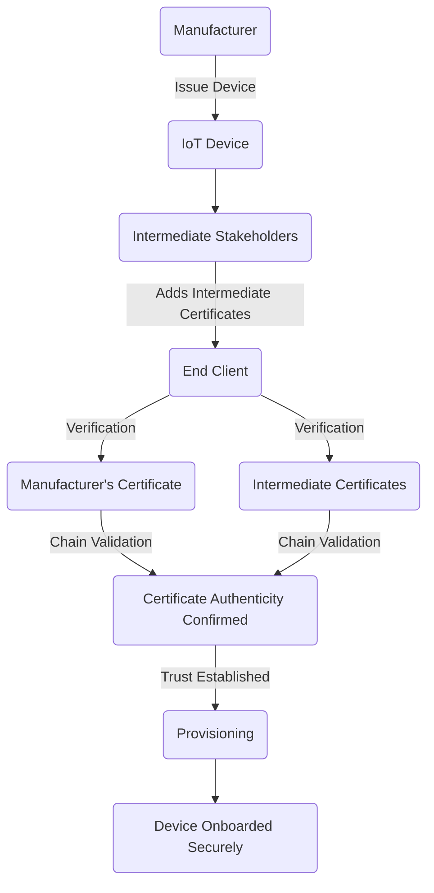
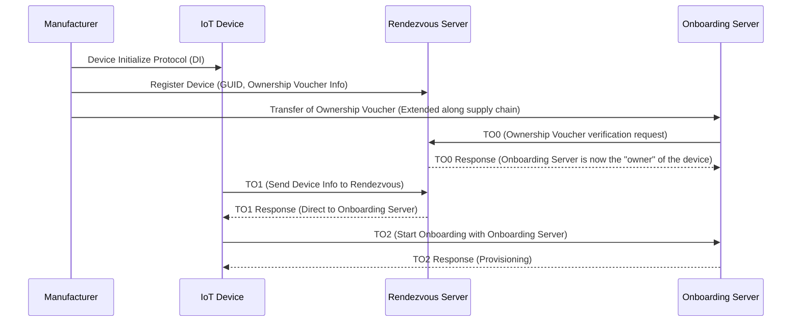
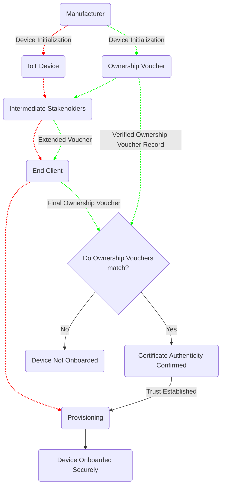
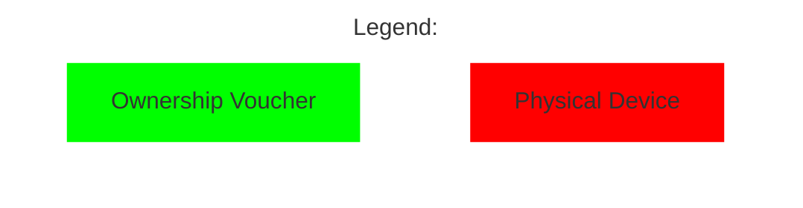
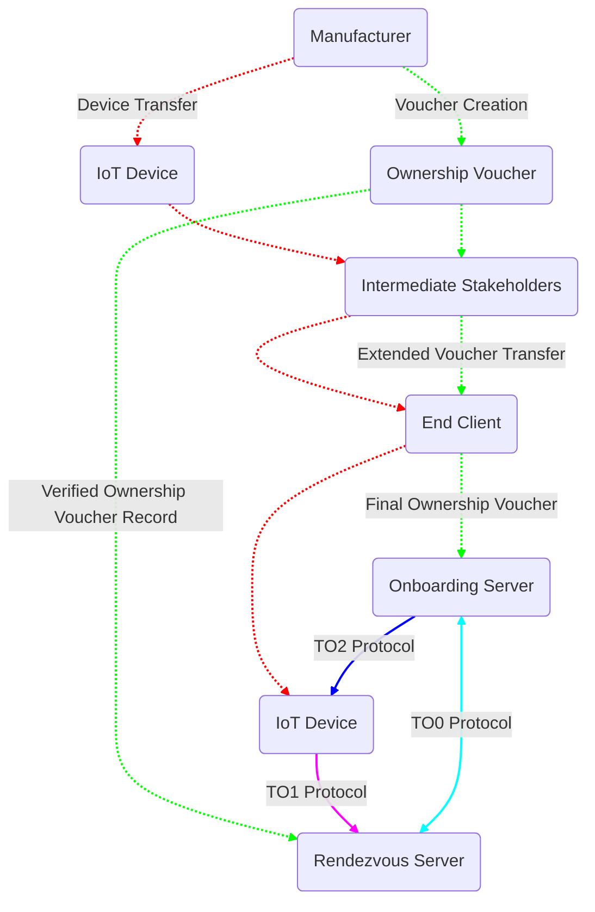

```mermaid
graph TD
    A(Manufacturer) -->|Issue Device| B(IoT Device)
    B --> C(Intermediate Stakeholders)
    C -->|Adds Intermediate Certificates| D(End Client)
    D -->|Verification| E(Manufacturer's Certificate)
    D -->|Verification| F(Intermediate Certificates)
    E -->|Chain Validation| G(Certificate Authenticity Confirmed)
    F -->|Chain Validation| G
    G -->|Trust Established| H(Provisioning)
    H --> I(Device Onboarded Securely)
```

```mermaid
sequenceDiagram
    participant M as Manufacturer
    participant D as IoT Device
    participant RS as Rendezvous Server
    participant OS as Onboarding Server

    M->>D: Device Initialize Protocol (DI)
    M->>RS: Register Device (GUID, Ownership Voucher Info)
    M->>OS: Transfer of Ownership Voucher (Extended along supply chain)

    OS->>RS: TO0 (Ownership Voucher verification request)
    RS-->>OS: TO0 Response (Onboarding Server is now the "owner" of the device)

    D->>RS: TO1 (Send Device Info to Rendezvous)
    RS-->>D: TO1 Response (Direct to Onboarding Server)

    D->>OS: TO2 (Start Onboarding with Onboarding Server)
    OS-->>D: TO2 Response (Provisioning)
```

```mermaid
graph TD
    A(Manufacturer) -.->|Device Initialization| B(IoT Device)
    A -.-> |Device Initialization| C(Ownership Voucher)
    B -.-> D(Intermediate Stakeholders)
    C -.-> D
    D -.-> E(End Client)
    D -.-> |Extended Voucher| E(End Client)
    E -.-> |Final Ownership Voucher| F{Do Ownership Vouchers\n match?}
    C -.-> |Verified Ownership Voucher Record| F

    F -- Yes --> H(Certificate Authenticity Confirmed)
    E -.-> I
    H -->|Trust Established| I(Provisioning)
    I --> K(Device Onboarded Securely)

    F -- No --> G(Device Not Onboarded)

    linkStyle 0 stroke:#ff0000,stroke-width:2px;
    linkStyle 2 stroke:#ff0000,stroke-width:2px;
    linkStyle 4 stroke:#ff0000,stroke-width:2px;
    linkStyle 9 stroke:#ff0000,stroke-width:2px;

    linkStyle 1 stroke:#00ff00,stroke-width:2px;
    linkStyle 3 stroke:#00ff00,stroke-width:2px;
    linkStyle 5 stroke:#00ff00,stroke-width:2px;
    linkStyle 6 stroke:#00ff00,stroke-width:2px;
    linkStyle 7 stroke:#00ff00,stroke-width:2px;
```

```mermaid
graph TD

    subgraph Legend:
        A_legend["Ownership Voucher"]
        B_legend["Physical Device"]

        A_legend ~~~ B_legend

        style A_legend fill:#00ff00,stroke:#ffffff00
        style B_legend fill:#ff0000,stroke:#ffffff00
    end

    style Legend: fill:#ffffff00,stroke:#ffffff00
```

```mermaid
graph TD

    A(Manufacturer) -.->|Device Transfer| B(IoT Device)
    A -.-> |Voucher Creation| C(Ownership Voucher)
    B -.-> D(Intermediate Stakeholders)
    C -.-> D
    D -.-> E(End Client)
    D -.-> |Extended Voucher Transfer| E(End Client)
    E -.-> |Final Ownership Voucher| I(Onboarding Server)
    C -.-> |Verified Ownership Voucher Record| G(Rendezvous Server)
    G <--> |TO0 Protocol| I

    E -.-> M(IoT Device)
    M --> |TO1 Protocol| G

    I --> |TO2 Protocol| M

    %%N{TO0 Protocol\nDo Ownership Vouchers\n match?} -- Yes --> H(Rendezvous Server now\npoints to that Onboarding Server\nfor this device)
    %%N -- No --> L(Nothing Happens)

    %%Z{Are those Device Credentials\nstored in the\nRendezvous Server?}

    %%O{TO1 Protocol\nHas TO0 been performed for\nthis device credentials?} -- Yes --> P(Device is redirected\nto that Onboarding Server)
    %%O -- No --> R(Try again\nafter delay)

    %%S(TO2 Protocol\nStart Provisioning) --> T(Device is redirected\nto that Onboarding Server)

    linkStyle 0 stroke:#ff0000,stroke-width:2px;
    linkStyle 2 stroke:#ff0000,stroke-width:2px;
    linkStyle 4 stroke:#ff0000,stroke-width:2px;
    linkStyle 5 stroke:#ff0000,stroke-width:2px;
    linkStyle 9 stroke:#ff0000,stroke-width:2px;

    linkStyle 1 stroke:#00ff00,stroke-width:2px;
    linkStyle 3 stroke:#00ff00,stroke-width:2px;
    linkStyle 5 stroke:#00ff00,stroke-width:2px;
    linkStyle 6 stroke:#00ff00,stroke-width:2px;
    linkStyle 7 stroke:#00ff00,stroke-width:2px;

    linkStyle 8 stroke:#00ffff,stroke-width:2px;
    linkStyle 10 stroke:#ff00ff,stroke-width:2px;
    linkStyle 11 stroke:#0000ff,stroke-width:2px;
```
