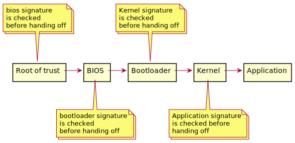
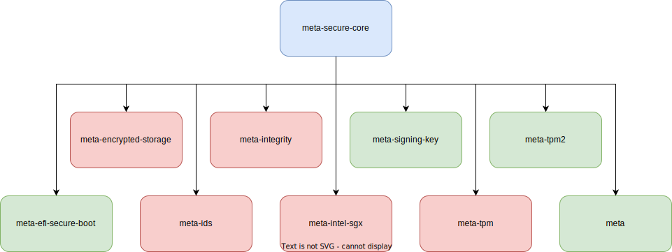
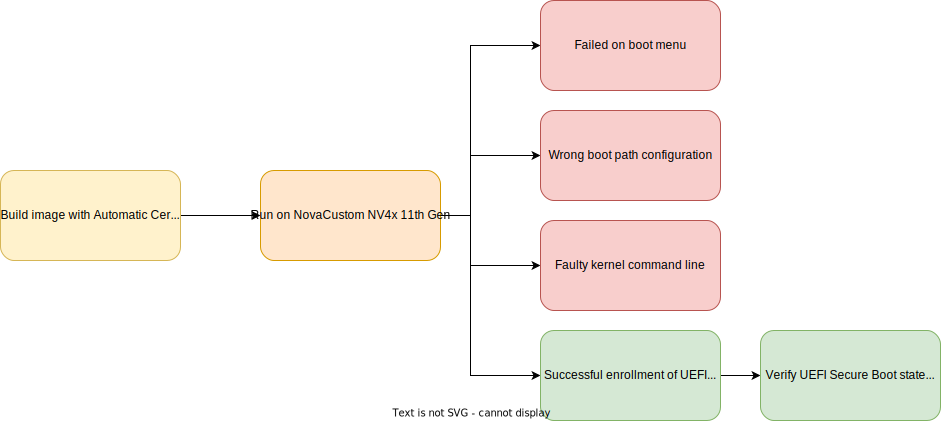
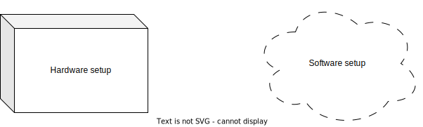
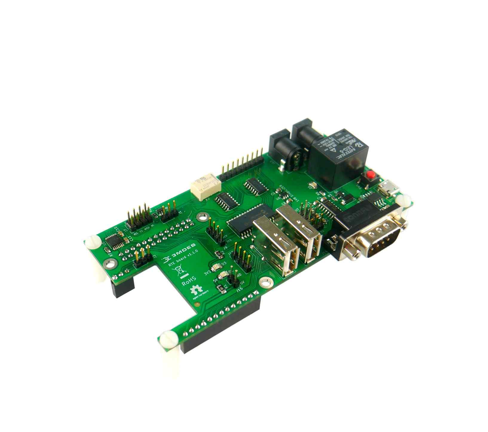
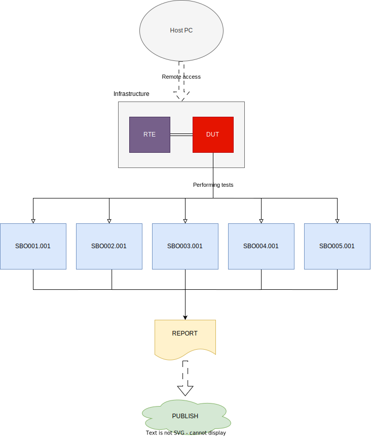
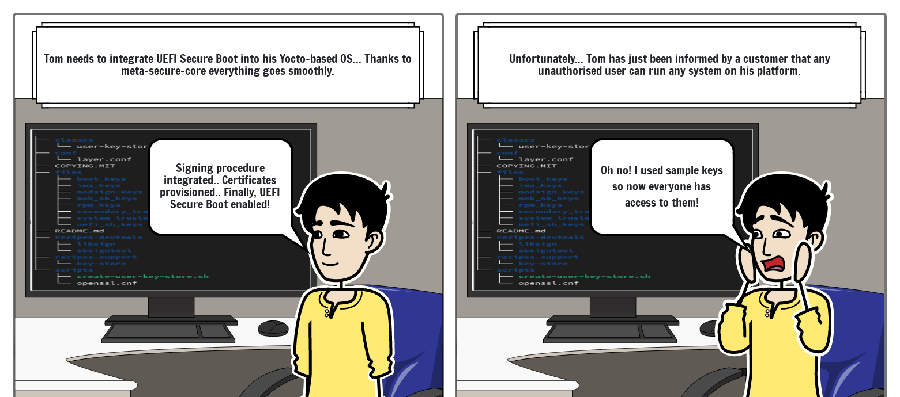

class: center, middle, intro

# Dealing with UEFI Secure Boot support using Yocto Project

### Yocto Summit 2023

## Tomasz Żyjewski


---

# Agenda

* `whoami`
* Who we are?
* Recap from first part
    - booting secure embedded device
    - UEFI Secure Boot
    - meta-secure-core
    - running image with UEFI Secure Boot integrated
* Build improvements
* UEFI Secure Boot compliance
* Keys management
* CI/CD integration
* Demo

???

Ok, so let me start with the agenda. First, I will introduce myself and the
company I work in. Next I will do quick recap about the content of the similar
topic that I present one year ago at Yocto Summit 2022.11 edition. After that
I will discuss about what changed from the last year and cover more topics.
First of which will be the importance of UEFI Secure Boot compliance, including its
role in ensuring the integrity and security of the boot process. This topic will
shed light on the requirements and practices that need to be followed for UEFI
Secure Boot compliance. Then I will go into keys management process in context
of UEFI Secure Boot and how we can provide that while we integrate
meta-secure-core layer. Next I will quickly talk about CI/CD integration and
how we can do that while working with Yocto. At the end I will present the
effect of our changes that were presented in build improvements section.

---

# `whoami`

.center[]

.center[Tomasz Żyjewski]
.center[_Embedded Systems Team Leader_]
.right-column50[
* over 4 years in 3mdeb
* integration of update systems and OS creation for embedded devices
* system security
]
.left-column50[
* <a href="https://twitter.com/tomzy_0"> @tomzy_0</a>
* <a href="mailto:tomasz.zyjewski@3mdeb.com">
  tomasz.zyjewski@3mdeb.com</a>
]

???

Okay, so here is something about me. I am an Embedded Systems Engineer at
3mdeb. I am working here for over four years during which I gained knowledge
related to Yocto. I have quite a lot of experience in integrating update systems
(mostly based on swupdate). I also enjoy working on security aspects of embedded
devices with topics like Secure and Verified Boot, hardening kernel and
bootloader, encrypting partitions. In my spare time, I try to find Yocto layers
that seem to provide interesting functionalities and test them. If you would
like to contact me, you can use e-mail listed here or just hit me on twitter.

---

# Who we are ?

.center[.image-15[].image-15[].image-15[].image-15[]]
.center[.image-35[]]

* coreboot licensed service providers since 2016 and leadership participants
* UEFI Adopters since 2018
* Yocto Participants and Embedded Linux experts since 2019
* Official consultants for Linux Foundation fwupd/LVFS project since 2020
* IBM OpenPOWER Foundation members since 2020

???

I would like to introduce the company I come from. 3mdeb is embedded systems
consulting company. We are based in Gdańsk, Poland. One of our main goals is to
promote open source solutions by using them on firmware and systems we work on.
We strongly believe that following the path of open source increases the
security of the devices around us in today's world, and thus also ours.

---

# Recap from first part

* Previous presentation: <https://www.youtube.com/watch?v=OA9TKkwFFIE>
    - enabling UEFI Secure Boot on x86 platform with Yocto: getting started with
    meta-secure-core

.center[]

???

As mentioned in the agenda, I will start with a quick recap. Last year I present
some kind of getting started guide of using meta-secure-core layer to integrate
UEFI Secure Boot. But first, lets remind how booting secure embedded device
looks like. So here on the diagram we have a typical bootflow of x86 platform.

For it to be secure we have to ensure two things. The first is the fact that
subsequent firmware elements do not have attack vectors. The second is to ensure
that no one can interrupt the boot process to upload their firmware.

Now we can introduce more security terms. RoT and CoT. Root of trust is a source
we can trust to be secure. In the case of UEFI Secure Boot, this is the Platform
Key. The point is that the trust state of a given
boot element must be based on something that we have no doubts about. RoT can be
hardware (TPM for example) or provided by a previous item from the boot process.

Chain of Trust is achieved when every previous element verifies each element of
the platform's boot. To achieve this, many components are used to cover the
entire boot process, i.e. starting the BIOS, bootloader, and loading the Linux
kernel. UEFI Secure Boot uses certificates stored in the BIOS to verify GRUB and
OS.

---

# Recap from first part

* Explained in chapter 32 of UEFI Specification
    - information from there should always take precedence over other documents
* Key goal
    - provide infrastructure for UEFI Image load time authentication
    - UEFI Secure Boot authenticates OS Loaders and UEFI drivers
    - Platform Owner manage platfrom's security policy and can check integrity and
    security of a given UEFI Image
* The subject of UEFI Secure Boot is very complex and multi-level
    - we will cover about 1%
    - want to focus on integrating that within Yocto Project
* Worth to check available training courses
    - <https://p.ost2.fyi/>

???

Now let's talk about UEFI Secure Boot. Its definition is contained in chapter 32
of the UEFI specification and the information contained therein should be more
important than in other documents.

The main task of UEFI SB is the ability to authorize the system, bootloader and
UEFI drivers using the keys provided by the platform owner. It is he who decides
what is considered correct to run on the platform by signing the components with
his key. What is important here is that authentication happened during the
loading of images. Not in any given random point.

UEFI Authenticated Variables are used to provide UEFI Secure Boot Policy that
determine which images and certificates are allowed and which are not.

---

# Recap from first part

* meta-secure-core overview:
    - provides couple of common and platform-specific security features
    - repository: <https://github.com/jiazhang0/meta-secure-core>

.center[]

???

Here is a quick overview of the layer that we used in our project. At the slide
there is a link to the layer repository, layer is active, we continue to see new
commits there fixing bugs reported by users. The layer is compatible with the
nanbield version, which is the latest Yocto release.

meta-secure-core layer consist of 9 sublayers witch provides different
functionalities. On the diagram we used green color for those, that we used in
our project.

---

# Recap from first part

* For test we used `meta-dts` layer
    - repository: <https://github.com/Dasharo/meta-dts>
* Status

.center[]

???

For our tests we used (and are still using) meta-dts layer which we are using to
create DTS image. DTS stands for Dasharo Tools Suite and is a set of tools
running in a minimal Linux environment to deploy, update, and maintain firmware
on Dasharo-supported devices. Dasharo is an open-source firmware distribution
crafted with an emphasis on trustworthiness, privacy, and liberty. For example,
DTS can be used to update the firmware on a device or run the initial
deployment, even when no OS is currently installed.

Diagram presents our effor we managed to achieve last year.

---

# Build improvements

* Building `iso` image
    - one of the requirements of base image
    - introduces regression
* Error

.code-11px[

```bash
| install: cannot stat '/build/tmp/deploy/images/genericx86-64/grub-efi-bootx64.efi':
  No such file or directory
| WARNING: exit code 1 from a shell command.
| DEBUG: Python function do_bootimg finished
ERROR: Task (/repo/meta-dts-distro/recipes-dts/images/dts-base-sb-image.bb:do_bootimg)
  failed with exit code '1'
```

]

* Solution
    - temporary: `IMAGE_FSTYPES:remove = "iso"`
    - cause of issue: `live-vm-common.bbclass` and `efi_populate_common` function

???

Now, lets talk about improvements that we made in Yocto metadata used to build
DTS-based image for UEFI Secure Boot.

We generated the first problem ourselves. With the development of DTS, we
started to provide images in ISO format. Because of this, compiling the image
with SB ended with the error shown on the screen. For some reason, the task
generating root fs was expecting a grub-efi-bootx64.efi file in the deploy dir.
Our solution was to remove the iso image compilation, but we performed debugging
to find the cause of the error. It turned out that the problem was with custom
modifications to the grub-efi recipe in meta-secure-core, which were not
compatible with the live-vm-common class found in poky. Once this issue is
resolved, we are happy to introduce a contribution to the meta-secure-core layer.

---

# Build improvements

* Correct binaries in `/boot` partition
    - we need signed `grubx64.efi`
    - BIOS looks for `bootx64.efi`
* Signed `grubx64.efi`
    - signed by `grub-efi-efi-secure-boot.inc`
    - other binary provided while creating rootfs
    - workaround to deploy proper binary
* Signed `bootx64.efi`
    - signed by `shim_git.bb`
    - `bootx64.efi` deployed to DEPLOY_DIR
    - add `bootx64.efi;EFI/BOOT/ \` to `IMAGE_EFI_BOOT_FILES`

???

sbctl

---

# Build improvements

* sbctl
    - Secure Boot key manager
    - dependencies: `util-linux`, `binutils`, `Go`, asciidoc
    - another tool for Secure Boot management (similar to mokutil)
* Features
    - user-friendly
    - manages secure boot keys
    - live enrollment of keys
    - signing database to help keep track of files to sign
    - JSON output
* Recipe `sbctl_0.12.bb`
    - binary release installation
    - do not want to add golang to Yocto cache yet
    - missing in Yocto recipe index

???

integrating more meta-signing-keys

---

# Build improvements

* meta-signing-key
    - `create-user-key-store.sh` execution
    - creates user keys
* Output
.code-11px[

```bash
MASTER_KEYS_DIR = "/home/tzyjewski/projects/dts/meta-secure-core/meta-signing-key/scripts/user-keys"
IMA_KEYS_DIR = "${MASTER_KEYS_DIR}/ima_keys"
IMA_EVM_KEY_DIR = "${MASTER_KEYS_DIR}/ima_keys"
RPM_KEYS_DIR = "${MASTER_KEYS_DIR}/rpm_keys"
BOOT_KEYS_DIR = "${MASTER_KEYS_DIR}/boot_keys"
MOK_SB_KEYS_DIR = "${MASTER_KEYS_DIR}/mok_sb_keys"
SYSTEM_TRUSTED_KEYS_DIR = "${MASTER_KEYS_DIR}/system_trusted_keys"
SECONDARY_TRUSTED_KEYS_DIR = "${MASTER_KEYS_DIR}/secondary_trusted_keys"
MODSIGN_KEYS_DIR = "${MASTER_KEYS_DIR}/modsign_keys"
UEFI_SB_KEYS_DIR = "${MASTER_KEYS_DIR}/uefi_sb_keys"
GRUB_PUB_KEY = "${MASTER_KEYS_DIR}/boot_keys/boot_pub_key"
GRUB_PW_FILE = "${MASTER_KEYS_DIR}/boot_keys/boot_cfg_pw"
OSTREE_GPGDIR = "${MASTER_KEYS_DIR}/rpm_keys"
RPM_GPG_NAME = "PKG-Prod"
RPM_GPG_PASSPHRASE = "root"
RPM_FSK_PASSWORD = "root"
BOOT_GPG_NAME = "BOOT-Prod"
BOOT_GPG_PASSPHRASE = "root"
OSTREE_GPGID = "PKG-Prod"
OSTREE_GPG_PASSPHRASE = "root"
OSTREE_GRUB_PW_FILE = "${GRUB_PW_FILE}"
```

]
* Add to kas config file

---

# UEFI Secure Boot compliance

* Importance of UEFI Secure Boot compliance
    - enhanced system security
    - regulatory and industry standards
    - system reliability and trust
* Tools
    - built-in UEFI menu
    - cmdlines utilities; e.g. `sbctl` on Linux, `bcdedit` on Windows
    - third-party tools
* Key management in context of compliance
    - verification not only of the implementation itself but also of maintenance
    - maintaining trust and integrity
    - adaptability and control

???

Now let's look into UEFI Secure Boot compliance. Basically if any platform is
UEFI Secure Boot compatible it mean that we can enable that future on given
platform. Compliance is rather checked with a bunch of tests. Importing it
ensures that the computer's firmware and boot process are protected against
unauthorized or malicious code execution. This heightened security reduces the
risk of malware infections and boot-level attacks, making the system more
resistant to cyber threats.

Many industries and regulatory bodies require UEFI Secure Boot compliance as a
security best practice. Importing compliance helps organizations meet these
standards and demonstrate their commitment to data security and regulatory
compliance, which can be crucial in sectors like healthcare, finance, and
government.

It also builds trust in the integrity of the system's boot
process. It verifies that only trusted and digitally signed software components
are allowed to run during boot-up, contributing to the reliability and stability
of the computing environment, especially in critical applications and enterprise
settings.

There are tools and utilities available for checking UEFI Secure Boot compliance
on a computer system.

Most modern UEFI firmware implementations provide a setup utility accessible
during the system boot process. Within this utility, you can typically find
options related to Secure Boot. You can check if Secure Boot is enabled, view
the list of trusted keys, and configure Secure Boot settings. Accessing the UEFI
setup utility usually involves pressing a specific key (e.g., F2, Del, F12)
during system startup.

We have also a cmdlines utilities, both on linux (like `sbctl` or `mokutil`) and
Windows (e.g. `bdedit`).

There are also third-party software tools designed specifically for checking
UEFI Secure Boot compliance and providing detailed information about the
system's Secure Boot status. Examples include "UEFI Secure Boot Check" and
"UEFITool."

We also need to remember about the key management while talking about the
compliance. Important is not only to check if given platform is ready to enable
UEFI Secure Boot but also if we will be able to maintain the trust and integrity
in the future.

---

# UEFI Secure Boot compliance

* Test environment
.center[]

* Remote Testing Environment
.left-column50[
* docs: <https://docs.dasharo.com/transparent-validation/rte/introduction>
* layer: <https://github.com/3mdeb/meta-rte>]
.right-column50[.center[]]

???

When checking UEFI Secure Boot complaince we need to prepare a test environment
which consist of software and hardware parts.

Software part is a set of tests that logically check and verify if given scenario
in context of Secure Boot can be successfully ended.

Hardware part of tests environment consist of providing two key functionalities
that are used in testing.

* Power management
* Serial logging

---

# UEFI Secure Boot compliance

* UEFI Secure Boot compliance for Dasharo
    - <https://docs.dasharo.com/unified-test-documentation/dasharo-security/206-secure-boot>
    - verifies basic functionality against UEFI specifications
    - can be used for different BIOS but need proper setup
* Tests logic
    - list of steps
    - simple, unambiguous actions to be carried out
    - every test verifies one isolated scenario
* Robot Framework
    - generic open source automation framework
    - implemented in Python
    - tests code: <https://github.com/Dasharo/open-source-firmware-validation>

???

---

# UEFI Secure Boot compliance

.center[]

???

---

# UEFI Secure Boot compliance

* Future improvements
    - we can come up with a lot of different scenarios
    - should comply with the UEFI Secure Boot specification
* Additional tests to consider
    - testing the execution of correctly signed firmware when the built-in RTC
    (Real-Time Clock) is malfunctioning, affecting certificate date verification
    - testing the execution of file signed for intermediate certificate
    - testing the range of supported cryptographic algorithms in the firmware

---

# Keys management

* Investigating meta-signing-key

.code-11px[

```bash
λ tree -L 2
.
├── classes
│   └── user-key-store.bbclass
├── conf
│   └── layer.conf
├── COPYING.MIT
├── files
│   ├── boot_keys
│   ├── ima_keys
│   ├── modsign_keys
│   ├── mok_sb_keys
│   ├── rpm_keys
│   ├── secondary_trusted_keys
│   ├── system_trusted_keys
│   └── uefi_sb_keys
├── README.md
├── recipes-devtools
│   ├── libsign
│   └── sbsigntool
├── recipes-support
│   └── key-store
└── scripts
    ├── create-user-key-store.sh
    └── openssl.cnf
```

]

---

# Keys management

.center[]

* Last time we used dev keys provided in meta-signing-key
    - investigate `create-user-key-store.sh` script

---

# Certificate rotation

.center[]

* Certificate rotation using meta-secure-core
    - on host, generate certs, update build environment, rebuild and sign
    components
    - on target, apply update, enroll certificate

---

# CI/CD integration

* Speed-up processes
.center[]
* Presentation example
    - automatic release on tag pushed
    - setup with KAS tool
    - Yocto sstate-cache integrated

---

# CI/CD integration

* Current solution

.center[]

---

# CI/CD integration

* Target solution

.center[]

---

# Demo

* Demo scenario
  1. Generate custom keypair
  1. Build signed image to provision UEFI Secure Boot certificates via Automatic
     Certificate Provision
  1. Boot custom Linux-based operating system, signed with generated keys
  1. Generate new keypair, build another image, try to boot on platform
* Next slides will present the results

???

1. Generate custom keypair
2. Use signed image to provision SB certificates via Automatic Certificate
   Provision
3. Try to boot Ubuntu
4. Try to boot signed image

---

# Demo

* Generate custom keypair
    - `create-user-key-store.sh`
    - take a list of inputs

.code-11px[

```bash
λ ./scripts/create-user-key-store.sh
KEYS_DIR: /home/tzyjewski/projects/dts/meta-secure-core/meta-signing-key/scripts/user-keys
Enter RPM/OSTree GPG keyname (use dashes instead of spaces) [default: PKG-SecureCore]: PKG-Sec
Enter RPM/OSTree GPG e-mail address [default: SecureCore@foo.com]: tomasz.zyjewski@3mdeb.com
Enter RPM/OSTREE GPG comment [default: Signing Key]: Prod Key
Using boot loader gpg name: BOOT-Sec
Using boot loader gpg email: tomasz.zyjewski@3mdeb.com
Using boot loader gpg comment: Prod Key
    Press control-c now if and use -bn -bm -bc arguments if you want
    different values other than listed above
Enter RPM/OSTREE passphrase: root
Enter IMA passphrase: root
Enter boot loader GPG passphrase: root
Enter boot loader locked configuration password(e.g. grub pw): root
```

]

* Creates `key.conf` mentioned earlier, need to be put in `local.conf`

---

# Demo

* For `Automatic Certificate Provision` process mention manual certs removal
    - go inside BIOS Menu
    - remove KEK, PK certs and databases
    - we cannot enable Secure Boot with PK removed
* With Secure Boot disabled boot image from USB

.code-11px[

```bash
Booting `Automatic Certificate Provision`
/EndEntire
file path: /ACPI(a0341d0.0)/PCI(0.14)/USB(0.0)
  /HD(1.800.14bfc.b030108e00000)/File(\EFI\BOOT)/File(\LockDown.efi)/EndEntire
Platform is in Setup Mode
Created KEK Cert
Created db Cert
Created dbx Cert
Created PL Cert
Platform is in User Mode
Platform is set to boot securely
Prepare to execute system warm reset after 3 seconds...
```

]

---

# Demo

* Boot testing
    - we removed default certs, so we should not be able to run Ubuntu/Windows
    - only our image should be able to boot
* Ubuntu/Windows
.code-11px[

```bash
SecureBoot is enabled
Booting `Windows Boot Manager` failed due to `Access Denied`.
Press any key to continue...
```

]
* Custom image
    - boots `grub`
    - enabling `UEFI_SB` adds password protection, e.g. to change cmdline
    - here `root/root`
.code-11px[

```bash
# mokutil --sb-status
SecureBoot enabled
# sbctl status
Installed:      ✗ sbctl is not installed
Setup Mode:     ✓ Disabled
Secure Boot:    ✓ Enabled
Vendor Keys:    none
```

]

---

# Demo

* Scenario where we want to rotate our certificate
    - rerun script to generate new keys
    - rebuild images
* Any of images could not be boot (Ubuntu/Windows/custom)
.code-11px[

```bash
SecureBoot is enabled
Booting `Windows Boot Manager` failed due to `Access Denied`.
Press any key to continue...
```

]
* We could rerun `Automatic Certificate Provision` or investigate `sbctl` to
  rotate certs on live image

---

# Summary

* As on Yocto Summit 2022.11, we again leaned into the meta-secure-core and UEFI
  Secure Boot integration in Yocto-based projects
* We have fixed several bugs and integrated another UEFI Secure Boot status tool
  into the system
* We devoted this year's presentation to additional aspects of maintaining a
  project with UEFI Secure Boot enabled
    - testing of the compliance
    - keys management
    - CI/CD integration

---

# Resources

* <https://p.ost2.fyi/>
* <https://uefi.org/specs/UEFI/2.10/>
* <https://docs.oracle.com/en/operating-systems/oracle-linux/notice-sboot/OL-NOTICE-SBOOT.pdf>
* <https://github.com/Wind-River/meta-secure-core>

---

<br>
<br>
<br>

## .center[Q&A]
