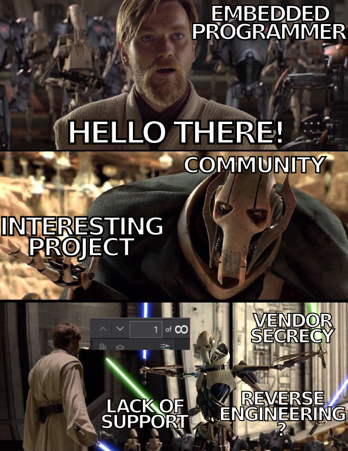
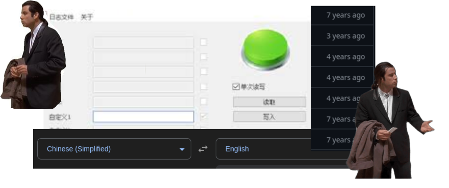

class: center, middle, intro

# Practical Security for Embedded Systems: Implementing TEE and Secure Storage

### Yocto Project DevDay 2024

## Tymoteusz Burak

## Daniil Klimuk


---

# `whoami`

.left-column50[.center[


Tymoteusz Burak

_Junior Embedded Systems Developer_]

- <a href="mailto:tymoteusz.burak@3mdeb.com">
  
    tymoteusz.burak@3mdeb.com
  </a>
- <a href="https://www.linkedin.com/in/tymoteusz-burak/">
    
      linkedin.com/in/tymoteusz-burak
    </a>]

.right-column50[.center[


Daniil Klimuk

_Junior Embedded Systems Developer_]
- <a href="mailto:daniil.klimuk@3mdeb.com">
  
    daniil.klimuk@3mdeb.com
  </a>
- <a href="https://www.linkedin.com/in/daniil-klimuk-9358a1271/">
    
      linkedin.com/in/daniil-klimuk-9358a1271/
    </a>
  ]

???

- Time for this slide: 30s
- Idea/goal of this slide: Tymek i Daniil intro
- What to say:
    - TODO
- Notes:
    - TODO

---

# Who we are ?

.center[
.image-15[]
.image-15[]
.image-15[]
.image-15[] ]

.left-column50[

 ]

.right-column50[  ]

<br>
<br>
<br>
<br>
<br>
<br>

- coreboot licensed service providers since 2016 and leadership participants
- UEFI Adopters since 2018
- Yocto Participants and Embedded Linux experts since 2019
- Official consultants for Linux Foundation fwupd/LVFS project since 2020
- IBM OpenPOWER Foundation members since 2020

???

- Time for this slide: 30s
- Idea/goal of this slide: 3mdeb intro
- What to say:
    - TODO
- Notes:
    - TODO

---

# Agenda

- TEE theory (Tymoteusz Burak)
- What is TEE (2-4 slides)?
  + concept description
  + overview on different architectures
  + we focus on ARM Cortex-A
  + we mentiond briefly Intel, RISC-V. Intel
  + secure world vs non-secure world
- TEE API specififactions (1-2 slides)
  + focus Global Platform API
    - show that something liek this exist,s try to explain the purpose
- OPTEE - about + history
  + https://www.iwavesystems.com/product/op-tee-for-android-and-linux/
  + architecture, tee-supplicant
- optee - features overview (1 slide)
- fTPM - autopromotion + example of trusted service  (1 slide)
- optee secure storage (1 slide)
  + https://optee.readthedocs.io/en/latest/architecture/secure_storage.html

extras:
- What is Trusted Execution Environment?
  + Normal World vs Secure World
    - Different architecture overview
  + Root of trust
  + TEE use cases
    - Secure storage

- TEE practice (Daniil Klimuk)
    - Introduction
    - What to integrate and why?
    - Compilation from source vs vendor binaries.
    - Linux/U-Boot and Yocto integration.
    - OP-TEE Secure Storage.
    - Experiments on Rockchip RK3566 SoC.
    - Zarhus OS.
- Outro and sources.

???

- Time for this slide: 30s
- Idea/goal of this slide: Present entire presentation in a short way
- What to say:
    - TODO
- Notes:
    - TODO

---

<br>
<br>
<br>

## .center[Intro]

???

- I want to ask some questions to better get the feel of your familiarity with
the concepts that will be covered in this talk
- Please raise your hand
  + "Who has heard of Trusted Execution Environment?"
  + "Who has heard of Arm TrustZone?"
  + "Who has worked with these concepts within Yocto?"
  + "Who is currently working on projects that require secure execution or data isolation?"

---

# What is Trusted Execution Environment?

.center[  ]

<br>

_"A trusted execution environment (TEE) means a secure area which can guarantee
the confidentiality and integrity of the code and data inside of this area."_*


.footnote[

\* J. Yao and V. Zimmer, *Building secure firmware: Armoring the foundation of the platform*. Apress, 2020. doi: 10.1007/978-1-4842-6106-4

]

???

- "from general information to specifics"
- There's no agreed on firm definition and a lot of sources define their own
- Definition taken from _"Building Secure Firmware, Armoring the Foundation of
the Platform"_
  + Will be listed in resources
  + **Usually** refers to the possibility of TEE being only isolated via
software which is not the case in some definitions.
- Can be isolated via software
- The term TEE was coined somewhere in 2000s
- Used to be "secure area of the main processor" but the definition has
broadened
  + Can even be a separate device, more on that later
- A device can have multiple TEEs nowadays
- Used implementation is mostly dependant on underlying CPU architecture

---

# Common Ground in TEE definition

### What it ensures:

- **Data integrity**: preventing unauthorized entities from altering data when
data is being processed.

- **Data confidentiality**: Guarantees the authenticity of the executed code.

- **Code integrity**: The confidentiality of its code, data and runtime states
stored on a persistent memory.

???

- This is the part that is universally agreed on
- This exact definition is from Confidential Computing Consortium
  - A Linux Foundation Project which aims to accelerate the adoption of Trusted
  Execution Environment (TEE) technologies and standards
  - With Confidential Computing being the protection of data in use by
  performing computation in a hardware-based, attested Trusted Execution
  Environment.

---

# TEE locations

.right-column45[
.center[

**CPU based TEE**


]
]

.left-column70[
### Examples

- Arm Trustzone
- Intel SGX (Software Guard Extensions)
- AMD SEV (Secure Encrypted Virtualization)

]

---

# TEE locations

.right-column45[
.center[

**Coprocessor Based TEE (One SoC)**


]
]

.left-column70[
### Examples

- Integrated TPM (Trusted Platform Module)
- Apple Secure Enclave

]

???

- ARM Cortex-M based Secure Subsystem
- Shared resources
  - Power, memory, caches, buses, clock signals
  - Larger vector of attack
- Hardware/firmware vulnerabilities could be exploited

---

# TEE locations

.right-column45[
.center[

**Coprocessor Based TEE (External)**


]
]

.left-column70[
### Examples

- Discrete TPM (Trusted Platform Module)
- Apple T2 Chip
- Google Titan M

]

---

# Normal vs Secure World - Arm Cortex-A

.left-column50[
<br>

### Overview

<br>
<br>
<br>
<br>
<br>
<br>
<br>

### Exception Levels


]

.right-column50[

`

]

???

- Arm TrustZone
- Arm operates on Exception Levels which roughly correlate with x86 protection
rings
- High-level overview
  + Trusted Applications are also protected from each other
- The Secure Partition Manager is optional, just as you can run a Rich OS without a
  hypervisor you can run a Trusted OS without the Secure Partition Manager
- Worth noting that the Secure Partition Manager can be also implemented in EL3
- You can see how the data goes through Secure Monitor which with conjuction
with Memory Managment Unit manages memory access
  - Data goes from Rich OS via "Secure Monitor Call (SMC)"
- Secure montior also saves the states of Normal and secure world when switching
contexts to be able to restore them when switching back

---

# Normal vs Secure Worlds - Arm Cortex-M

.center[  ]

???

- The division between worlds in Armv8-M is memory map-based
  + The transitions take place automatically via exception handling
  + This means that, when running code from the secure memory, the processor
    state is secure, and, when running code from non-secure memory, the processor
    state is non-secure 
  + This also excludes the monitor mode and the need for any secure monitor
    firmware

---

# Secure Storage

_"Secure storage is an essential element in IoT devices in that
cryptographic keys, trust anchors, access control lists, and other policies
need to be stored in ways that resist software attacks and ideally resist
attackers who have physical access to the device."_*

.center[

]

.footnote[

\* CHERUVU, Sunil, et al. Demystifying internet of things security: successful iot device/edge and platform security deployment. Springer Nature, 2020.

]


???

- Quote from Demystifying Internet of Things Security
- Arm Trustzone doesn't actually add Secure Storage support on it's own as
it's mainly responsible for protecting sensitive memory during runtime
- You have to load private keys first
- Thus you also have to ensure that the place youre storing your secrets on is
secure

---

# Root of trust/Chain of trust

.center[

]

???

- This is a broad topic that could easily be an entire presentation on its own,
and while I won't go into too much depth, I'll give a high-level overview.
- Essentially, the Trusted Execution Environment (TEE) plays a critical role in
extending the chain
of trust all the way into userspace applications, enhancing overall system
security.
- However TEE can't establish a root of trust on it's own so it's vital to be
aware of necessity of secure bootloader.

---

# Root of trust/Chain of trust

.center[

]

???

- This is a broad topic that could easily be an entire presentation on its own,
and while I won't go into too much depth, I'll give a high-level overview.
- Essentially, the Trusted Execution Environment (TEE) plays a critical role in
extending the chain
of trust all the way into userspace applications, enhancing overall system
security.
- However TEE can't establish a root of trust on it's own so it's vital to be
aware of necessity of secure bootloader and secure storage
-

---

# APIs

???

- The GlobalPlatform organization has created a committee to define an open
security architecture for consumer and connected devices.
- In order to run software in the TEE, we need to standardize the application
program interface (API). Currently, the GlobalPlatform (GP) organization has
developed a set of specifications so that the digital services and devices can
be trusted and managed securely, including the secure element
(SE), trusted execution environment (TEE), and trusted platform services (TPSs)

---

# Secure Storage vs fTPM

### TPM


### fTPM


### fTPM as TA


???

- If you've heard of fTPM you might be wondering how does it differ
  + Without going into much detail fTPM can be thought as a software implementation of a TPM module
  + Normally it's implemented only in the firmware so the OS calls TPM and firmware is responsive for handling requests and security
  + Can be implemented in TEE thus offering better security and extended functionality
---

# Secure Storage vs fTPM - Shameless Plug

.center[

### For those interested more about fTPM's

[
](https://fosdem.org/2024/schedule/event/fosdem-2024-3097-securing-embedded-systems-with-ftpm-implemented-as-trusted-application-in-tee/)
]

---

# TEE implementations

.pure-table[
| Company              | Product         | Hardware Used          | API Standard                  | Is Open-Source?       | Supported by Yocto? |
|----------------------|-----------------|------------------------|-------------------------------|-----------------------|---------------------|
| Alibaba              | Cloud Link TEE  | ?                      | GlobalPlatform                | ❌                    | ❌                  |
| Apple                | Secure Enclave  | Separate processor     | Proprietary                   | ❌                    | ❌                  |
| BeanPod              | ISEE            | ARM TrustZone          | GlobalPlatform                | ❌                    | ❌                  |
| Huawei               | iTrustee        | ARM TrustZone          | GlobalPlatform                | ❌                    | ❌                  |
| Google               | Trusty          | ARM / Intel            | Proprietary                   | Partially Open-Source | ❌                  |
| Linaro               | OP-TEE          | ARM TrustZone          | GlobalPlatform                | ✔️                     | ✔️                   |
| ProvenRun            | ProvenCore      | ARM TrustZone          | ?                             | ❌                    | ❌                  |
| Qualcomm             | QTEE            | ARM TrustZone          | GlobalPlatform + Proprietary  | ❌                    | ❌                  |
| Samsung              | TEEgris         | ARM TrustZone          | GlobalPlatform                | ❌                    | ❌                  |
| TrustKernel          | T6              | Arm / Intel            | GlobalPlatform                | ? *                   | ❌                  |
| Trustonic            | Kinibi          | ARM TrustZone          | GlobalPlatform                | ❌                    | ❌                  |
| Open-TEE             | Open-TEE        | Emulation only         | GlobalPlatform                | ✔️                     | -                   |
]

.footnote[

Sources:

[wikipedia.org/Trusted_execution_environment](https://en.wikipedia.org/wiki/Trusted_execution_environment)

]

???

- Wikipedia also specifies a formally-validated static partitioning über eXtensible
Micro-Hypervisor Framework.
    - Segway into Crosscon HV

---

<br>
<br>
<br>

## .center[How to implement TEE in practice?]

???
- End of Tymek's part
- Daniil will now show you how to use all this knowledge in practice

---

<!-- Daniil first slide -->

# Integration and verification

.left-column50[  ]
.righ-column50[.center[
    <br>
    <br>
    <br>
    <br>
    <span style="font-size: 40px;">
        Integration might not be as trivial as you think!
    </span>
]]

???

- Time for this slide: 30s
- Idea/goal of this slide:
    - Intro into practical part;
    - To point out the problem - integration is complex;
- What to say:
    - TODO
- Notes:
    - Mention, that practical part will focuse on ATF and OPTEE?

---

# What to integrate and why?


.center[  ]

.center[<span style="font-size: 30px;">
            A bunch of stuff to integrate, huh?
        </span>]


???

- Time for this slide: TODO
- Idea/goal of this slide: To decompose what parts should be integrated to use
  TEE on ARM.
- What to say:
    - TODO
- Notes:
    - What to integrate:
        - ATF (ARM Trusted Firmware);
         - OP-TEE OS;
        - TAs (like crypto or PKCS#11);
        - Userspace clients (like OpenSSL), libs (at least for communicating
          with TEE) and tools (TEE-specific tools, like tee-supplicant for
          OP-TEE);
        - Linux Kernel drivers and devicetree configuration.
    - Mention U-Boot integration as well.

---

# Compilation from source

.left-code-column50[
```bash
meta-arm
(...)
├── recipes-bsp
(...)
│   ├── trusted-firmware-a
(...)
│   │   ├── tf-a-tests_2.10.0.bb
│   │   ├── trusted-firmware-a_2.10.3.bb
│   │   └── trusted-firmware-a.inc
│   ├── trusted-firmware-m
│   │   ├── trusted-firmware-m_2.0.0.bb
│   │   ├── trusted-firmware-m-2.0.0-src.inc
│   │   ├── trusted-firmware-m.inc
(...)
├── recipes-security
│   ├── optee
│   │   ├── optee-client
│   │   │   ├── tee-supplicant@.service
│   │   │   └── tee-supplicant.sh
│   │   ├── optee-client_4.1.0.bb
│   │   ├── optee-client.inc
│   │   ├── optee-examples_4.1.0.bb
│   │   ├── optee.inc
(...)
│   │   ├── optee-os_4.1.0.bb
│   │   ├── optee-os.inc
(...)
```
]
.right-code-column50[
```bash
meta-arm-bsp
(...)
├── recipes-bsp
(...)
│   ├── trusted-firmware-a
(...)
│   │   ├── fiptool-native_2.8.6.bb
│   │   ├── tf-a-tests_2.8.0.bb
│   │   ├── tf-a-tests_%.bbappend
│   │   ├── trusted-firmware-a_%.bbappend
(...)
│   ├── trusted-firmware-m
(...)
│   │   ├── trusted-firmware-m_%.bbappend
│   │   └── trusted-firmware-m-corstone1000.inc
(...)
├── recipes-security
│   ├── optee
(...)
│   │   ├── optee-client
│   │   │   ├── tee-supplicant@.service
│   │   │   └── tee-supplicant.sh
(...)
│   │   ├── optee-ftpm_%.bbappend
│   │   ├── optee-os_4.%.bbappend
(...)
```
]

???

- Time for this slide: TODO
- Idea/goal of this slide: To show that meta-arm has everithing neccessary and
  even more.
- What to say:
    - TODO
- Notes:
    - Porting problems:
        - TODO

---

# Using vendor binaries

.center[  ]

.center[ <span style="font-size:30px;">There's some kind of mess here!</span>]

???

- Time for this slide: TODO
- Idea/goal of this slide: To say that though vendor supplied binaries were
  sopposed to make development easier, they made it even worse.
- What to say:
    - TODO
- Notes:
    - Weak points:
        - You have to trust vendor binaries;
        - You have to use vendor-specific tools, that are often not suitable for
          your environment, are very outdated, and lack support;
        - You do not have source code, so, debugging becames nearly impossible;
        - If you have a small contract or do not have direct contact with
          vendor, you will have to wait for support or, if you do not have time,
          you will have to go for an endless web-digging.

---

# U-Boot integration

1. Turn on `CONFIG_TEE` and `CONFIG_OPTEE` (and related configs, if needed)
  configs.
2. Link ATF (`BL31`):

    ```bb
    EXTRA_OEMAKE:append = " BL31=${DEPLOY_DIR_IMAGE}/atf.elf"
    ```

3. Link OP-TEE OS:

    ```bb
    EXTRA_OEMAKE:append = " TEE=${DEPLOY_DIR_IMAGE}/optee/tee.elf"
    ```

4. Check `binman` configuration, in case you are using other file formats (e.g.
 raw binary).

???

- Time for this slide: TODO
- Idea/goal of this slide: A list of steps on how to integrate ATF and OP-TEE
  into bootloader.
- What to say:
    - TODO
- Notes:
    - Present some U-Boot configs;
    - Present linking ATF and OP-TEE binaries;
    - Present linkinng binaries vs ELF using Binman.
    - Present `binman`-related problems.

---

# Linux integration

Turn on `CONFIG_TEE` and `CONFIG_OPTEE` (and related, if needed) configs, and
add OP-TEE OS and its memory to DTS (here are `CFG_TZDRAM_START`,
`CFG_TZDRAM_SIZE`, `CFG_SHMEM_START` and `CFG_SHMEM_SIZE`):

```dts
    reserved-memory {
		#address-cells = <2>;
		#size-cells = <2>;
		ranges;

		optee@8400000 {
			reg = <0x0 0x08400000 0x0 0x02000000>;
            no-map;
		};

		optee_shm: optee_shared_mem@a400000 {
			reg = <0x0 0x0a400000 0x0 0x00400000>;
		};
	};

	firmware {
		optee: optee {
			compatible = "linaro,optee-tz";
			method = "smc";
			shm = <&optee_shm>;
		};
    };
```

???

- Time for this slide: TODO
- Idea/goal of this slide: A list of steps on how to integrate ATF and OP-TEE
  into Linux.
- What to say:
    - TODO
- Notes:
    - Present some Linux Kernel configs;
    - Present devicetree modifications;
    - Some userspace tools and libs integration.

---

# Adding packages and recipes:

1. Add TFA `.bbappend` with configuration according to
  `meta-arm/recipes-bsp/trusted-firmware-a/trusted-firmware-a_2.10.3.bb`;
2. Add OP-TEE OS `.bbappend` with configuration according to
  `meta-arm-bsp/recipes-bsp/trusted-firmware-a/trusted-firmware-a_%.bbappend`;
3. You can add OP-TEE OS testsuite according to
  `meta-arm-bsp/recipes-security/optee/optee-test_4.%.bbappend`;
4. Add the packages to your packagegroup:

    ```bb
    RDEPENDS:${PN}-security = " \
        trusted-firmware-a \
        optee-client \
        optee-os \
        optee-test \
        libp11 \
    "
    ```
???

- Time for this slide: TODO
- Idea/goal of this slide: TODO
- What to say:
    - TODO
- Notes:
    - TODO

---

# OP-TEE Secure Storage

.center[  ]
<br>
.center[ Configured during OP-TEE OS compilation via `CFG_RPMB_FS` and `CFG_REE_FS`. ]

???

- Time for this slide: TODO
- Idea/goal of this slide: TODO
- What to say:
    - TODO
- Notes:
    - TODO

---

# Testing using vendor binaries

```bash
(...)
U-Boot SPL 2024.01 (Jan 08 2024 - 15:37:48 +0000)
(...)
NOTICE:  BL31: v2.3():v2.3-607-gbf602aff1:cl
NOTICE:  BL31: Built : 10:16:03, Jun  5 2023
(...)
I/TC: OP-TEE version: 3.13.0-723-gdcfdd61d0 #hisping.lin (gcc version 10.2.1...
(...)
root@quartz64-a:~# dmesg
(...)
root@quartz64-a:~# alias p11="pkcs11-tool --module /usr/lib/libckteec.so.0"
root@quartz64-a:~# p11 --show-info
E/LD:  ta_elf_load_main:1128 sys_map_zi stack
E/TC:? 0 ldelf_init_with_ldelf:126 ldelf failed with res: 0xffff000c
ERR [291] LT:ckteec_invoke_init:304: TEEC open session failed ffff000c from 3
(...)
root@quartz64-a:~# xtest
(...)
653 subtests of which 188 failed
106 test cases of which 76 failed
0 test cases were skipped
TEE test application done!
```

.center[A hard to debug problem without source code!]

???

- Time for this slide: TODO
- Idea/goal of this slide: TODO
- What to say:
    - TODO
- Notes:
    - TODO

---

# Testing self-ported image

```bash
U-Boot SPL 2024.01 (Jan 08 2024 - 15:37:48 +0000)
(...)
NOTICE:  BL31: v2.3():v2.3-607-gbf602aff1:cl
NOTICE:  BL31: Built : 10:16:03, Jun  5 2023
(...)
I/TC: OP-TEE version: 4.1.0-dev (gcc version 13.2.0 (GCC)) #1 Fri Jan 19 17:14:14 UTC 2024 aarch64
(...)
root@quartz64-a:~# alias p11="pkcs11-tool --module /usr/lib/libckteec.so.0"
root@quartz64-a:~# p11 --list-slots
Available slots:
Slot 0 (0x0): OP-TEE PKCS11 TA - TEE UUID 94e9ab89-4c43-56ea-8b35-45dc07226830
  token state:   uninitialized
(...)
root@quartz64-a:~# p11 --init-token --label mytoken --so-pin 1234567890
(...)
root@quartz64-a:~# p11 --list-slots
Available slots:
Slot 0 (0x0): OP-TEE PKCS11 TA - TEE UUID 94e9ab89-4c43-56ea-8b35-45dc07226830
  token label        : mytoken
  token manufacturer : Linaro
(...)
root@quartz64-a:~# xtest
(...)
+-----------------------------------------------------
28130 subtests of which 0 failed
106 test cases of which 0 failed
0 test cases were skipped
TEE test application done!
```

???

- Time for this slide: TODO
- Idea/goal of this slide: TODO
- What to say:
    - TODO
- Notes:
    - TODO

---

<!-- Zarhus and Zarhus OS -->

# Contact us

.left-column45[  ]

.right-column55[

## [Zarhus OS](https://docs.zarhus.com/)

]

<br>
<br>
<br>
<br>
<br>

.right-column50[

- <a href="https://3mdeb.com">https://3mdeb.com</a>

- <a href="https://cloud.3mdeb.com/index.php/apps/calendar/appointment/n7T65toSaD9t">Book a call</a>

- <a href="https://newsletter.3mdeb.com/subscription/PW6XnCeK6">
      Sign up for the newsletter
    </a>
  ]

.left-column50[

- <a href="https://www.linkedin.com/company/3mdeb">
    
      linkedin.com/company/3mdeb
    </a>

- <a href="mailto:contact@3mdeb.com">
    
      contact@3mdeb.com
  </a>

- <a href="https://www.facebook.com/3mdeb">
    
      facebook.com/3mdeb
  </a>

- <a href="https://twitter.com/3mdeb_com">
    
      @3mdeb_com
  </a>

  ]

<br>
<br>
<br>
<br>
<br>
<br>
<br>
<br>

Feel free to contact us if you believe we can help you in any way. We are always
open to cooperate and discuss.

???

- We're researching possibilities of using this technology on Embedded Devices
  + Especially in the context of our own Embedded Distribution Zarhus OS

---

# Resources

- #### M. Sabt, M. Achemlal, and A. Bouabdallah, "Trusted Execution Environment: What It is, and What It is Not," in *14th IEEE International Conference on Trust, Security and Privacy in Computing and Communications*, Helsinki, Finland, Aug. 2015. doi: 10.1109/Trustcom.2015.357

- #### S. Pinto and N. Santos, "Demystifying Arm TrustZone: A Comprehensive Survey," *ACM Computing Surveys*, vol. 51, no. 6, article 130, Jan. 2019. doi: 10.1145/3291047

- #### J. Yao and V. Zimmer, *Building secure firmware: Armoring the foundation of the platform*. Apress, 2020. doi: 10.1007/978-1-4842-6106-4

- #### CHERUVU, Sunil, et al. Demystifying internet of things security: successful iot device/edge and platform security deployment. Springer Nature, 2020.

- #### ZIMMER, Vincent; KRAU, Michael. Establishing the root of trust. UEFI. org document dated August, 2016.

- #### ZHAO, Shijun, et al. Providing root of trust for ARM TrustZone using on-chip SRAM. In: Proceedings of the 4th International Workshop on Trustworthy Embedded Devices. 2014. p. 25-36.

- #### [Roots of Trust are difficult - Matthew Garret](https://mjg59.dreamwidth.org/66907.html)

---

# Resources

- #### [TrustedFirmware - Hafnium Documentation](https://hafnium.readthedocs.io/en/latest/)

- #### [OP-TEE documentation](https://optee.readthedocs.io/en/latest/index.html)

- #### [Trusted Firmware-A Documentation](https://trustedfirmware-a.readthedocs.io/en/latest/#)

- #### [TrustZone Technology for Armv8-M](https://documentation-service.arm.com/static/5f873034f86e16515cdb6d3e?token=)

- #### [TrustZone Technology for Armv8-A](https://developer.arm.com/-/media/Arm%20Developer%20Community/PDF/Learn%20the%20Architecture/TrustZone%20for%20Armv8-A.pdf?revision=c3134c8e-f1d0-42ff-869e-0e6a6bab824f)

---

<!-- Outro, and Q&A-->

<br>
<br>
<br>

## .center[Q&A]

???

- Time for this slide: 5m
- Idea/goal of this slide: TODO
- What to say:
    - TODO
- Notes:
    - TODO
