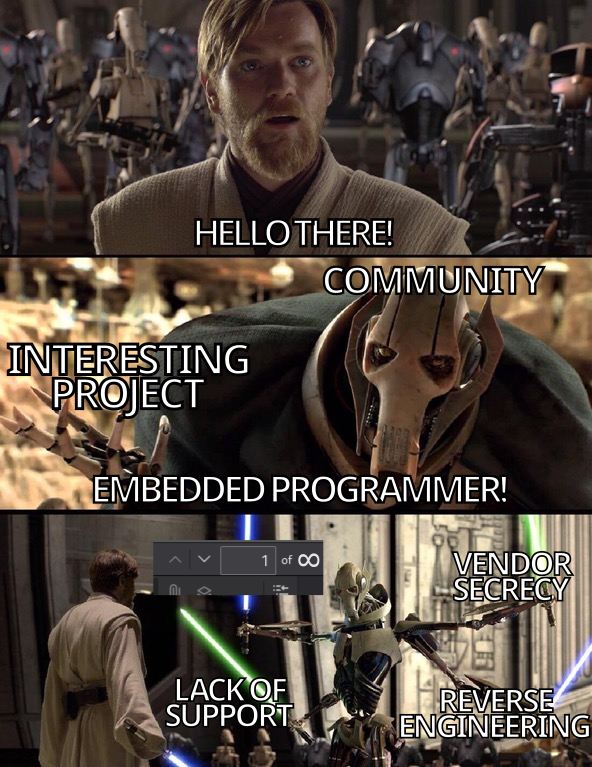

class: center, middle, intro

# Practical Security for Embedded Systems: Implementing TEE and Secure Storage

### Yocto Project DevDay 2024

## Tymoteusz Burak

## Daniil Klimuk

---

# `whoami`

.left-column50[.center[

Tymoteusz Burak

_Junior Embedded Systems Developer_]

- <a href="mailto:tymoteusz.burak@3mdeb.com">
  
    tymoteusz.burak@3mdeb.com
  </a>
- <a href="https://www.linkedin.com/in/tymoteusz-burak/">
    
      linkedin.com/in/tymoteusz-burak
    </a>]

.right-column50[.center[

Daniil Klimuk

_Junior Embedded Systems Developer_]
- <a href="mailto:daniil.klimuk@3mdeb.com">
  
    daniil.klimuk@3mdeb.com
  </a>
- <a href="https://www.linkedin.com/in/daniil-klimuk-9358a1271/">
    
      linkedin.com/in/daniil-klimuk-9358a1271/
    </a>
  ]

???

- Time for this slide: 30s
- Idea/goal of this slide: Tymek i Daniil intro
- What to say:
    - TODO
- Notes:
    - TODO

---

# Who we are ?

.center[
.image-15[]
.image-15[]
.image-15[]
.image-15[] ]

.left-column50[

 ]

.right-column50[  ]

 
 
 
 
 
 

- coreboot licensed service providers since 2016 and leadership participants
- UEFI Adopters since 2018
- Yocto Participants and Embedded Linux experts since 2019
- Official consultants for Linux Foundation fwupd/LVFS project since 2020
- IBM OpenPOWER Foundation members since 2020

???

- Time for this slide: 30s
- Idea/goal of this slide: 3mdeb intro
- What to say:
    - TODO
- Notes:
    - TODO

---

# Agenda

## Tymek

- What is TEE (2-4 slides)?
  + concept description
  + overview on different architectures
  + we focus on ARM Cortex-A
  + we mentiond briefly Intel, RISC-V. Intel
  + secure world vs non-secure world
- TEE API specififactions (1-2 slides)
  + focus Global Platform API
    - show that something liek this exist,s try to explain the purpose
- OPTEE - about + history
  + https://www.iwavesystems.com/product/op-tee-for-android-and-linux/
  + architecture, tee-supplicant
- optee - features overview (1 slide)
- fTPM - autopromotion + example of trusted service  (1 slide)
- optee secure storage (1 slide)
  + https://optee.readthedocs.io/en/latest/architecture/secure_storage.html

extras:
- What is Trusted Execution Environment?
  + Normal World vs Secure World
    - Different architecture overview
  + Root of trust
  + TEE use cases
    - Secure storage

## Daniil

- meme star wars
- optee support in Yocto (3 slides)
  + meta-arm - compilation from sources
  + problems with binaries provied by vendors
  + optee format (bin vs elf)
  + how other vendors provide/support optee (perhaps support matrix?)

- optee secure storage userland integration
  + https://optee.readthedocs.io/en/latest/building/userland_integration.html

- practical integration on RK3566 (3-4 slides)
  + adding optee to image
  + adding userspace components
- Zarhus integration
  + source code references
- bonus:
  + optee test suite integrtation

- Outro and sources

???

- Time for this slide: 30s
- Idea/goal of this slide: Present entire presentation in a short way
- What to say:
    - TODO
- Notes:
    - TODO

---

# What is Trusted Execution Environment?

.center[  ]

 

_"A trusted execution environment (TEE) means a secure area which can guarantee
the confidentiality and integrity of the code and data inside of this area.
**Usually** a TEE is an isolated execution environment."_

???

- "from general information to specifics"
- There's no agreed on firm definition and a lot of sources cite their own
- Definition taken from _"Building Secure Firmware, Armoring the Foundation of
the Platform"_
  + Will be listed in resources
  + **Usually** refers to the possibility of TEE being only isolated via
software which is not the case in some definitions.
- The term TEE was coined in 2000s so there's a lot of
- Used to be "secure area of the main processor" but the definition has
broadened
  + Can even be a separate device, more on that later
- A device can have multiple TEEs nowadays
- Used implementation is mostly dependant on underlying CPU architecture

---

# Coprocessor-based TEE

.left-column50[
.center[

**CPU based TEE**

]
]

.right-column50[
.center[

**Coprocessor Based TEE (One SoC)**

]
]

---

.center[

**Coprocessor Based TEE (External)**

]

---

# Normal vs Secure Worlds - Arm

.left-column50[
 
### Arm Cortex-A
]

.right-column50[
 
]

.left-column50[
 
 
 
 
 
### Arm Cortex-M
]

.right-column50[
 
]

???

- Arm TrustZone
- High-level overview
  + Trusted Applications are also protected from each other

---

# Normal vs Secure Worlds - Others

.center[  ]

---

# Secure Storage vs fTPM

### TPM

### fTPM

### fTPM as TA

???

- If you've heard of fTPM you might be wondering how does it differ
    - Without going into much detail fTPM can be thought as a software implementation of a TPM module
    - Normally it's implemented only in the firmware so the OS calls TPM and firmware is responsive for handling requests and security
    - Can be implemented in TEE thus offering better security and extended functionality
---

# Secure Storage vs fTPM - Shameless Plug

.center[

### For those interested more about fTPM's:

]

---

# Trusted Execution Environment (Secure OS) options

.pure-table[
| Company              | Product         | Hardware Used          | API Standard                  | Is Open-Source?       | Supported by Yocto? |
|----------------------|-----------------|------------------------|-------------------------------|-----------------------|---------------------|
| Alibaba              | Cloud Link TEE  | ?                      | GlobalPlatform                | ❌                    | ❌                  |
| Apple                | Secure Enclave  | Separate processor     | Proprietary                   | ❌                    | ❌                  |
| BeanPod              | ISEE            | ARM TrustZone          | GlobalPlatform                | ❌                    | ❌                  |
| Huawei               | iTrustee        | ARM TrustZone          | GlobalPlatform                | ❌                    | ❌                  |
| Google               | Trusty          | ARM / Intel            | Proprietary                   | Partially Open-Source | ❌                  |
| Linaro               | OPTEE           | ARM TrustZone          | GlobalPlatform                | ✔️                     | ✔️                   |
| ProvenRun            | ProvenCore      | ARM TrustZone          | ?                             | ❌                    | ❌                  |
| Qualcomm             | QTEE            | ARM TrustZone          | GlobalPlatform + Proprietary  | ❌                    | ❌                  |
| Samsung              | TEEgris         | ARM TrustZone          | GlobalPlatform                | ❌                    | ❌                  |
| TrustKernel          | T6              | Arm / Intel            | GlobalPlatform                | ? *                   | ❌                  |
| Trustonic            | Kinibi          | ARM TrustZone          | GlobalPlatform                | ❌                    | ❌                  |
| Open-TEE             | Open-TEE        | Emulation only         | GlobalPlatform                | ✔️                     | -                   |
]

.footnote[

Sources:

[wikipedia.org/Trusted_execution_environment](https://en.wikipedia.org/wiki/Trusted_execution_environment)

]

???

- Wikipedia also specifies a formally-validated static partitioning über eXtensible
Micro-Hypervisor Framework.
    - Segway into Crosscon HV

---

<!-- Daniil first slide -->

# Integration and verification

.left-column50[  ]
.righ-column50[.center[
     
     
     
     
    
        Integration might not be as trivial as you think!
    
]]

???

- Time for this slide: 30s
- Idea/goal of this slide:
    - Intro into practical part;
    - To point out the problem - integration is complex;
- What to say:
    - TODO
- Notes:
    - Mention, that practical part will focuse on ATF and OPTEE?

---

# What and why?

<!-- What to integrate why. -->

.center[  ]

???

- Time for this slide: TODO
- Idea/goal of this slide: To decompose what parts should be integrated to use TEE on ARM.
- What to say:
    - TODO
- Notes:
    - What to integrate:
        - ATF;
        - OP-TEE OS;
        - TAs;
        - Userspace libraries and tools.

---

<!-- OPTEE support in Yocto -->
<!-- Compilation from source -->

---

<!-- Using vendor binaries -->

---

<!-- Linux/bootloader integration via Yocto -->

---

<!-- Vendor/OPTEE/Yocto support matrix -->

---

<!-- Integration with system based on rk35566 -->

---

---

<!-- Zarhus and Zarhus OS -->

# Contact us

.left-column45[  ]

.right-column55[

## [Zarhus OS](https://docs.zarhus.com/)

]

 
 
 
 
 

.right-column50[

- <a href="https://3mdeb.com">https://3mdeb.com</a>

- <a href="https://calendly.com/3mdeb/consulting-remote-meeting">Book a call</a>

- <a href="https://newsletter.3mdeb.com/subscription/PW6XnCeK6">
      Sign up for the newsletter
    </a>
  ]

.left-column50[

- <a href="https://www.linkedin.com/company/3mdeb">
    
      linkedin.com/company/3mdeb
    </a>

- <a href="mailto:contact@3mdeb.com">
    
      contact@3mdeb.com
  </a>

- <a href="https://www.facebook.com/3mdeb">
    
      facebook.com/3mdeb
  </a>

- <a href="https://twitter.com/3mdeb_com">
    
      @3mdeb_com
  </a>

  ]

 
 
 
 
 
 
 
 

Feel free to contact us if you believe we can help you in any way. We are always
open to cooperate and discuss

???

- We're researching possibilities of using this technology on Embedded Devices
  + Especially in the context of our own Embedded Distribution Zarhus OS

---

# Resources

- #### M. Sabt, M. Achemlal, and A. Bouabdallah, "Trusted Execution Environment: What It is, and What It is Not," in *14th IEEE International Conference on Trust, Security and Privacy in Computing and Communications*, Helsinki, Finland, Aug. 2015. doi: 10.1109/Trustcom.2015.357

- #### S. Pinto and N. Santos, "Demystifying Arm TrustZone: A Comprehensive Survey," *ACM Computing Surveys*, vol. 51, no. 6, article 130, Jan. 2019. doi: 10.1145/3291047

- #### J. Yao and V. Zimmer, *Building secure firmware: Armoring the foundation of the platform*. Apress, 2020. doi: 10.1007/978-1-4842-6106-4

---

<!-- Outro, and Q&A-->

 
 
 

## .center[Q&A]

???

- Time for this slide: 5m
- Idea/goal of this slide: TODO
- What to say:
    - TODO
- Notes:
    - TODO
