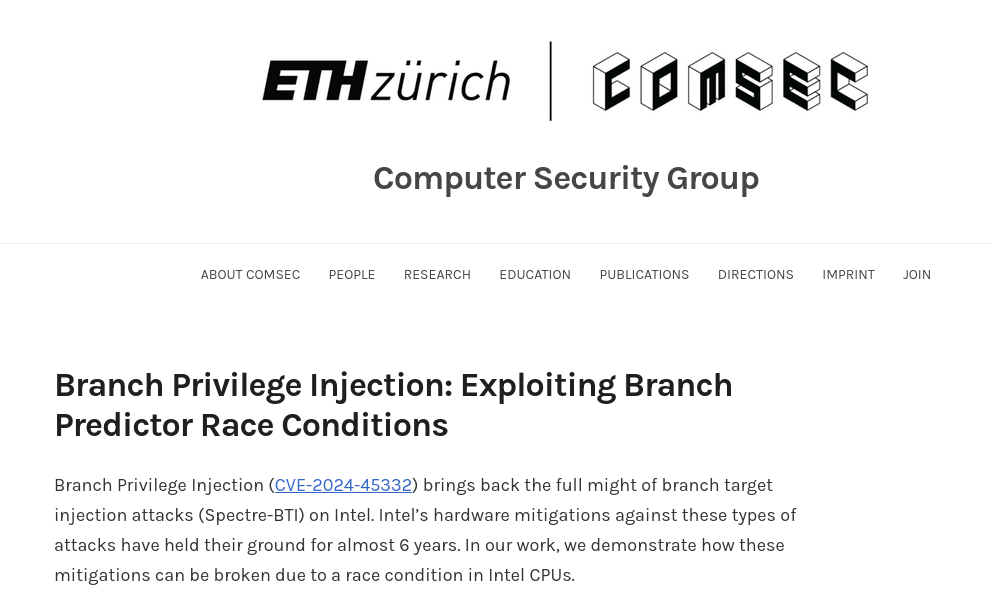
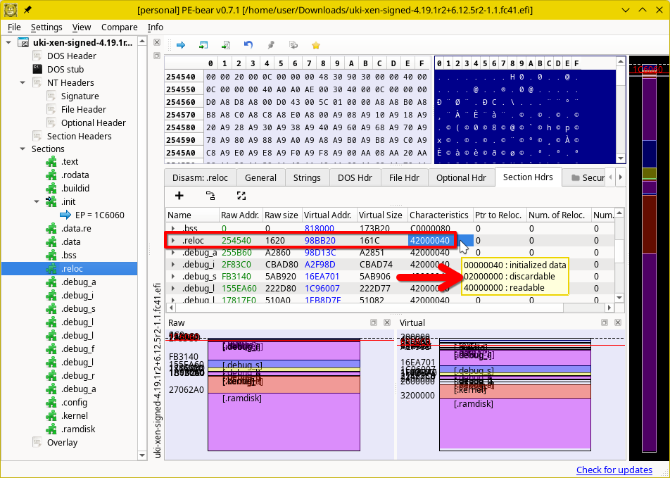
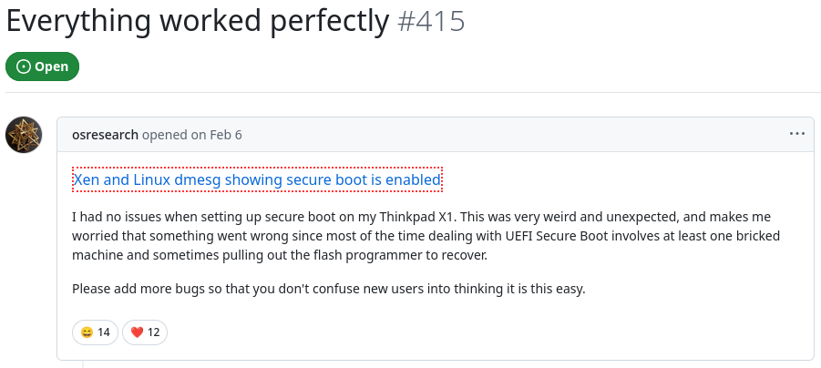
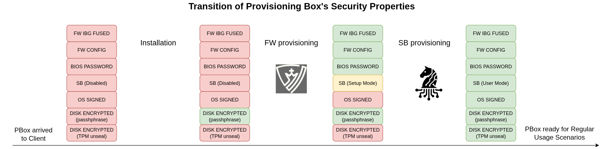
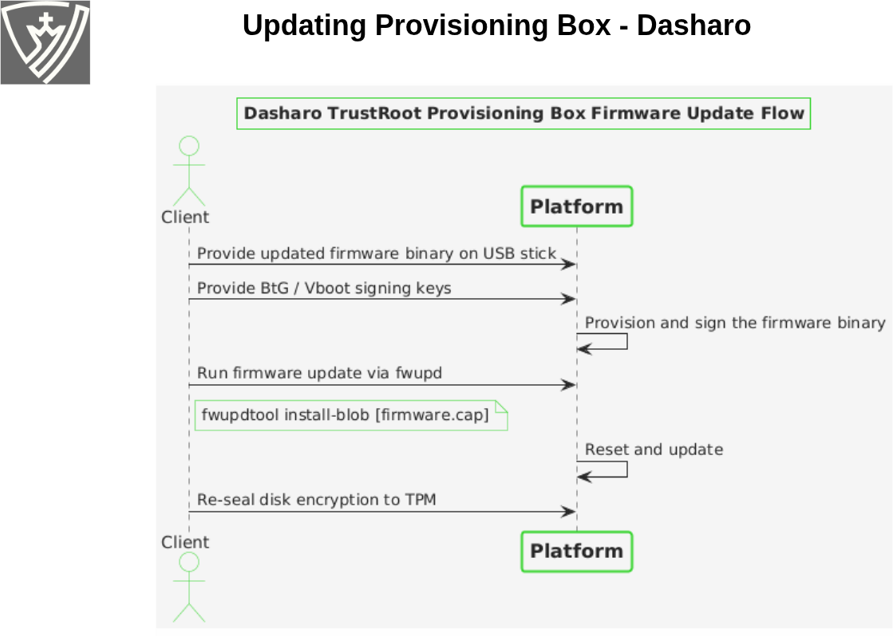
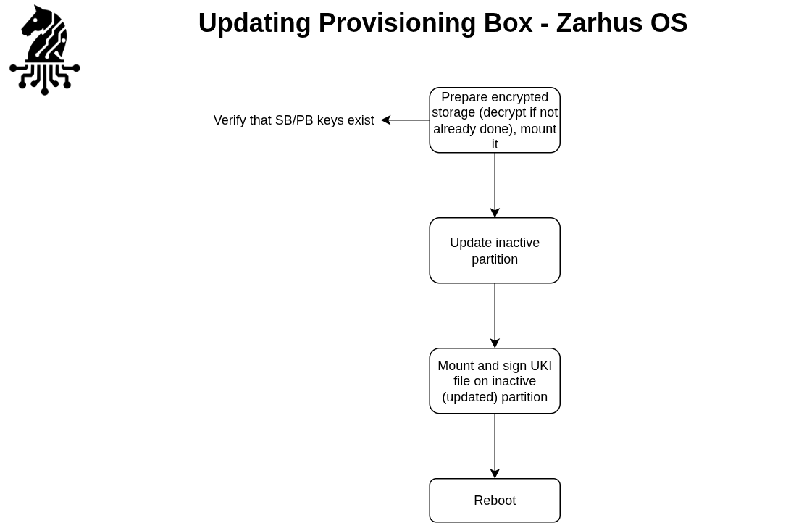

class: center, middle, intro

# Update on UEFI Secure Boot in Qubes OS

### Qubes OS Summit 2025

## Kamil Aronowski

---

# `whoami`

<!-- markdownlint-disable MD033 -->

<b>Kamil Aronowski</b> 
<i>Junior Embedded Systems Developer at 3mdeb</i>

 
 

<ul>
<li> Qubes OS user since 2020
<li> Volunteer UEFI Shim applications reviewer
<li> Interested in:
  <ul>
  <li> self-expression through writing documents and guides
  <li> reasonable security by design that doesn't get in the way
  <li> sipping hot coffee (especially when handling paperwork)
  </ul>
</ul>

 
 
 

<a href="mailto:kamil.aronowski@3mdeb.com">
  
    kamil.aronowski@3mdeb.com
  </a>

<!-- markdownlint-enable MD033 -->

---

# Who we are ?

.center[
  .image-15[]
  .image-15[]
  .image-15[]
  .image-15[]
]
.center[.image-35[]]

- coreboot licensed service providers since 2016 and leadership participants
- UEFI Adopters since 2018
- Yocto Participants and Embedded Linux experts since 2019
- Official consultants for Linux Foundation fwupd/LVFS project since 2020
- IBM OpenPOWER Foundation members since 2020

---

# Agenda

- Summary of the progress towards implementing UEFI Secure Boot support in
  Qubes OS
  + What we've managed to accomplish since [last year's
    talk](https://cfp.3mdeb.com/qubes-os-summit-2024/talk/NECPFQ/)
  + What both technical and non-technical challenges are still out there to be
    solved

---

# Quick intro and reminders

UEFI Secure Boot is a Chain of Trust technology, which covers very specific
part of x86 UEFI compliant boot process.

It ensures only trusted UEFI binaries signed with a recognized key can be
executed during the boot process.

UEFI Secure Boot has emerged as a critical feature to protect systems against
persistent firmware attacks and unauthorized code execution. While Qubes OS is
renowned for its security-centric approach, the official support for UEFI
Secure Boot remains a significant milestone yet to be fully realized.

---

# Quick intro and reminders

In other words, the desired outcome for this mechanism is:

**This is my machine and only the binaries, that I
consent to run, can be ran. Unsigned code can’t make any unaudited reads/writes**.

---

# Technical issues

_"But why should I even care about UEFI Secure Boot? I run everything in Xen
VMs, therefore I'm 100% protected from dom0 compromise."_

There might be even more non-technical than technical issues.

---

# Technical issues

<!-- markdownlint-disable MD033 -->
<small>
<ul>
<li> Security is a process and it's up to the user to apply updates and patches.
<li> <a
href="https://doc.qubes-os.org/en/latest/introduction/faq.html#why-does-qubes-use-xen-instead-of-kvm-or-some-other-hypervisor">The
Xen architecture allows for the creation of more secure systems</a> but nothing
is always 100% secure forever. 
(sometimes one needs to upgrade their CPU to receive microcode updates)
</ul>
</small>
 
 

<!-- markdownlint-enable MD033 -->

---

# Technical issues

- UEFI Secure Boot right here is a preventive measure for protection against
  malicious code.

---

# Non-technical issues

- It might help ensure compliance with standards and regulations.
  + We have quite a lot coming in EU in next years (CRA/NIS2).
  + More on that in the "[Seven Ways to Profit from Qubes OS under the EU
    CRA](https://cfp.3mdeb.com/qubes-os-summit-2025/talk/RLYLSR/)" presentation
    today.

- Because need for disabling security features to install security-focused Xen
  derivative brings bad vibe.
  + Currently users are advised to disable UEFI Secure Boot before
    installation.

- It may be required to not lose competitive advantage.
  + Some competing hypervisors already solved that problem.

---

# How we can implement this

From the relevant [GitHub
issue](https://github.com/QubesOS/qubes-issues/issues/8206#issuecomment-2599590015):

<!-- markdownlint-disable MD033 -->
<ul>
<small>
<i>
<li> ITL CA (or Qubes OS Secure Boot CA) - this one can be included in Dasharo
firmware, and I would like to make it accurate as soon I get confirmation from
ITL/Qubes OS Team that this is ok.
</i>
</small>
 
 
<small>
<i>
<li> Microsoft CA - We include official MSFT CA anyway, so if at some point it
works, it is okay for us, but I assume some users may want to wipe it.
</i>
</small>
 
 
<small>
<i>
<li> My own CA - I can imagine some rare paranoid cases where the user/company
would not like to rely on ITL CA or MSFT CA, and that case should supported.
The security community goal should be to provide tools and simplify that case
for those who would like to follow the my-own-ca path, even if that is a paid
premium product. At a minimum, a guide on how to follow that path should be
available.
</i>
</small>
</ul>
<!-- markdownlint-enable MD033 -->

---

# How we can implement this

From the relevant [GitHub
issue](https://github.com/QubesOS/qubes-issues/issues/8206#issuecomment-2599590015):

<!-- markdownlint-disable MD033 -->
<ul>
<small>

<i>
<li> ITL CA (or Qubes OS Secure Boot CA) - this one can be included in Dasharo
firmware, and I would like to make it accurate as soon I get confirmation from
ITL/Qubes OS Team that this is ok.
</i>

</small>
 
 
<small>

<i>
<li> Microsoft CA - We include official MSFT CA anyway, so if at some point it
works, it is okay for us, but I assume some users may want to wipe it.
</i>

</small>
 
 
<small>

<i>
<li> My own CA - I can imagine some rare paranoid cases where the user/company
would not like to rely on ITL CA or MSFT CA, and that case should supported.
The security community goal should be to provide tools and simplify that case
for those who would like to follow the my-own-ca path, even if that is a paid premium product. At a minimum, a
guide on how to follow that path should be available.
</i>

</small>
</ul>
<!-- markdownlint-enable MD033 -->

<small>We'll get to that later...</small>

---

# How do we want to implement it

There are 2 ways we can consider for our case:

1. "traditional", with intermediary bootloader
    (UEFI -> shim -> GRUB2 -> Xen -> dom0)

2. Unified Kernel Image (UEFI -> shim -> UKI)

---

# The UKI approach

A UKI here could be descrbied as _a single binary that combines Xen kernel,
dom0's kernel (Linux), dom0's initramfs signed images, UEFI stub and kernel
commandline_.

Building Unified Kernel Image allows image to be verified by UEFI verification
protocol which lowers needed security considerations.

This format is designed for UEFI-based booting and provides better integration
with Secure Boot.

---

# The UKI approach - drawbacks

This approach does come with some limitations and oddities, which need to be
addressed as per production deployment:

- It does not yet fulfill all Microsoft requirements
- What if we need to provide some alternative boot options?
- Why should we have a dozen duplicated entries in firmware boot manager?
- UX: how to modify kernel commandline (e.g. `qubes.skip_autostart`) or boot
  older kernel without a dedicated rescue media? Using GRUB2 mitigates this.
- ...

---

# The UKI approach - drawbacks

- [Unexpected bugs and odd behavior can happen
  sometimes](https://github.com/QubesOS/qubes-issues/issues/8206#issuecomment-3078795967):

    

      
    

---

# The UKI approach - drawbacks

<!-- markdownlint-disable MD033 -->
<i>
Xen EFI PE .reloc section has the MEM_DISCARDABLE flag in the section header 
"Characteristics" field 
 
Both shim and some downstream patched Grub2 tend to honor this flag so they 
don't load the `.reloc` section of Xen. However Xen PE boot path parses the 
`.reloc` section twice, therefore [...] crash
</i>
<!-- markdownlint-enable MD033 -->

---

# The UKI approach

Despite the drawbacks, it's worthwhile to use this approach as base for testing
UEFI Secure Boot. We already have an implementation in the
[qubes-vmm-xen-unified](https://github.com/QubesOS/qubes-vmm-xen-unified)
repository.

While this may not be sufficient for Microsoft signing, we can utilize this
implementation for our own solution.

At the very least have a working infrastructure for when certain technical
challenges have been resolved...

---

# Technical challenges

<small>
Most challenges on Xen side seem to boil down to waiting for XenServer to
develop a solution.

<!-- markdownlint-disable MD033 -->
<ul>
<li> Following coming from discussion with Andrew:
  <ul>
  <li> Xen needs support for SBAT, which is not present yet.
  <li> NX_COMPAT is required for SBAT support.
  <li> [kexec has to leverage SHA256 for checking integrity of executed
  images.](https://xenbits.xen.org/docs/unstable/misc/kexec_and_kdump.txt)
  <li> kexec purgatory code should be built-in Xen.
    <ul>
    <li> can't be past userspace
    <li> [implemented in
    Linux](https://github.com/torvalds/linux/blob/master/arch/x86/purgatory/purgatory.c#L44)
    </ul>
  <li> [Livepatching has to check patches
  signatures.](https://xenbits.xen.org/docs/unstable/misc/livepatch.html)
  <li> Command line has to be correctly handled (enabling/disabling some
  options may be unsafe):
    <ul>
    <li> `ima_appraise` - integrity measurements
    <li> `lockdown` - kernel lockdown feature
    <li> `spec-ctrl` - controls for speculative execution
    sidechannel mitigations
    </ul>
  <li> New hypercalls ABI for checking all passed pointers.
    <ul>
    <li> Requirement from Microsoft - no pointer can be used unchecked
    </ul>
  <li> Some debug options should have ability to be disabled at compilations
  time: GDB stub.
  </ul>
</ul>
<!-- markdownlint-enable MD033 -->
</small>

---

# Technical challenges

<small>
Most challenges on Xen side seem to boil down to waiting for XenServer to
develop a solution.

<!-- markdownlint-disable MD033 -->
<ul>
<li> There are also concerns mentioned by Demi:
  <ul>
  <li> `/dev/xen/privcmd` since it allow root to overwrite dom0 kernel memory,
  <li> address space isolation, nested virtualization PVH dom0 and PV IOMMU
  </ul>
</ul>
<!-- markdownlint-enable MD033 -->
</small>

---

# Other challenges

<small>
UX, i.e. how to have UEFI Secure Boot manageable by mere mortals?

    

      
    

</small>

---

# Other challenges

But wait, remember this slide?

<!-- markdownlint-disable MD033 -->
<ul>
<small>

<i>
<li> ITL CA (or Qubes OS Secure Boot CA) - this one can be included in Dasharo
firmware, and I would like to make it accurate as soon I get confirmation from
ITL/Qubes OS Team that this is ok.
</i>

</small>
 
 
<small>

<i>
<li> Microsoft CA - We include official MSFT CA anyway, so if at some point it
works, it is okay for us, but I assume some users may want to wipe it.
</i>

</small>
 
 
<small>

<i>
<li> My own CA - I can imagine some rare paranoid cases where the user/company
would not like to rely on ITL CA or MSFT CA, and that case should supported.
The security community goal should be to provide tools and simplify that case
for those who would like to follow the my-own-ca path, even if that is a paid premium product. At a minimum, a
guide on how to follow that path should be available.
</i>

</small>
</ul>
<!-- markdownlint-enable MD033 -->

---

# Contact us

<small> If only there was something like a provisioning box, where one pushes a
shiny button, and the whole deployment happens automatically... </small>

 

    

      
    

---

# Contact us

    

      
    

---

# Contact us

    

      
    

---

# Contact us

We are open to cooperate and discuss

- <a href="mailto:contact@3mdeb.com">
    
      contact@3mdeb.com
  </a>

- <a href="https://www.facebook.com/3mdeb">
    
      facebook.com/3mdeb
  </a>

- <a href="https://twitter.com/3mdeb_com">
    
      @3mdeb_com
  </a>

- <a href="https://www.linkedin.com/company/3mdeb">
    
      linkedin.com/company/3mdeb
    </a>

- <a href="https://3mdeb.com">https://3mdeb.com</a>

- <a href="https://cloud.3mdeb.com/index.php/apps/calendar/appointment/n7T65toSaD9t">
    Book a call</a>

Feel free to contact us if you believe we can help you in any way. We are
always open to cooperate and discuss.

---

# References

- [Implementing UEFI Secure Boot in Qubes OS: Challenges and Future
  Steps](https://cfp.3mdeb.com/media/qubes-os-summit-2024/submissions/NECPFQ/resources/implementing-uefi-secure-boot-in-qubes_tHn32fM.pdf),
  Piotr Król, Qubes OS Summit 2024
- [Enabling UEFI Secure Boot in XCP-ng: Establishing a Robust Chain of
  Trust](https://cfp.vates.tech/media/xen-meetup-2025/submissions/8JBQKC/resources/enabling-uefi-secure-boot-in-xcp-ng_AhWnRqA.pdf),
  Piotr Król, Xen Winter Meetup 2025
- The ["Sign \[Qubes OS\] boot
  images"](https://github.com/qubesOS/qubes-issues/issues/8206) thread

---

 
 
 

## .center[Q&A]
