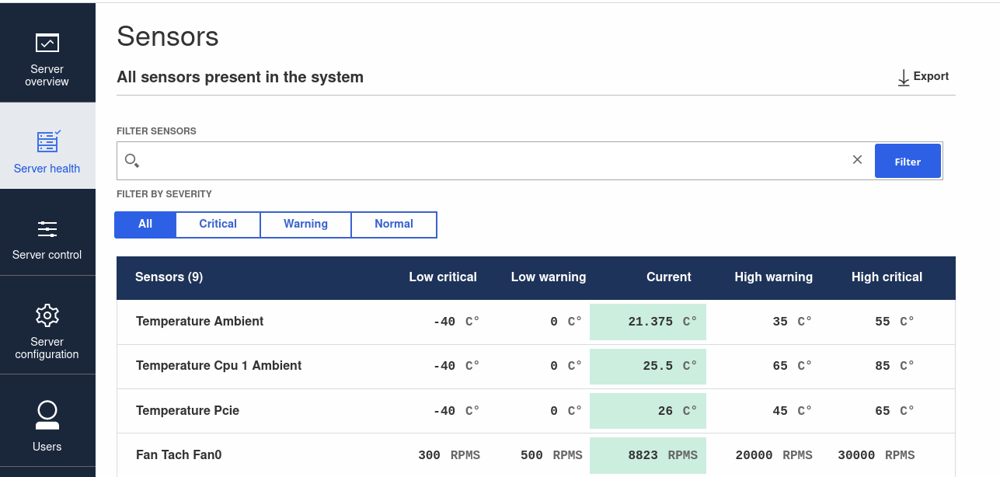

class: center, middle, intro

# Unveiling OpenBMC: Exploring features and preparing the build environment

### Yocto DevDay 2023 

## Maciej Pijanowski


---
# `whoami`

.center[]

.center[Maciej Pijanowski]
.center[_Engineering Manager_]
.right-column50[
- over 7 years in 3mdeb
- Open-source contributor
- Interested in:
  - build systems (e.g., Yocto)
  - embedded, OSS, OSF
  - firmware/OS security
]

.left-column50[
- <a href="https://twitter.com/macpijan"> @macpijan</a>
- <a href="mailto:maciej.pijanowski@3mdeb.com"> maciej.pijanowski@3mdeb.com</a>
- <a href="https://www.linkedin.com/in/maciej-pijanowski-9868ab120"> linkedin.com/in/maciej-pijanowski-9868ab120</a>
]

---
# Who are we?

.center[.image-15[] .image-15[] .image-15[] .image-15[]]
.center[.image-35[]]

* coreboot licensed service providers since 2016 and leadership participants
* UEFI Adopters since 2018
* Yocto Participants and Embedded Linux experts since 2019
* Official consultants for Linux Foundation fwupd/LVFS project since 2020
* IBM OpenPOWER Foundation members since 2020

---
# Agenda

* What is BMC? 
* What is OpenBMC? 
* OpenBMC features
* Repository overview
* Build environment
* Adding Supermicro X11SSH-TF
* Results
* Next steps

---
# What is BMC?

.center[.image-80[]]

.footnote[https://www.aspeedtech.com/server_ast2500/]

???

* BMC (Baseboard Management Controller) is a specialized microcontroller
  embedded on a server board
* Enables administrators to manage servers remotely, even if the firmware/OS
  running on a server is not operational
* Offers various features, such as:
  - remote power control,
  - sensors monitoring,
  - event logging,
  - remote console and video (KVM) access.
* Security features
  - Secure Boot (RoT for the whole server)
  - flash monitoring and protection
  - attestation of firmware and hardware components
* ARM SoC capable of running Linux

* BMC stands for Baseboard Management Controller and is a critical component in
server management.
* The BMC acts as a bridge between the hardware components and the system
administrator, providing remote monitoring and control capabilities.
* It enables administrators to manage servers even when the operating system is
not accessible or operational.
* BMC offers various features such as remote power control, sensor monitoring,
event logging, and remote console access.
* Understanding what a BMC is and its role in server management is essential to
grasp the significance of OpenBMC and its capabilities.


  - act as a Root of Trust for the whole server board


---
# What is OpenBMC?

* Linux Foundation project since 2018
* Linux distribution for BMCs
* A collection of open-source tools implementing BMC features
* Built with Yocto
* Code: https://github.com/openbmc/openbmc
* Documentation: https://github.com/openbmc/docs

.center[.image-35[]]

.footnote[https://commons.wikimedia.org/wiki/File:OpenBMC_logo.png]

---
# OpenBMC status

* Project in dynamic development
* Some significant changes in the last years
  - switching from OpenBMC REST API to Redfish API
  - switching from phosphor-webui to webui-vue
  - switching mechanisms for inventory, power control, ...
* Documentation not always keeps up with the development
  - you may come across some outdated/deprecated documents
  - not particularly clear for a newcomer what is up to date
  - it may be confusing at first

.center[.image-40[]]

.footnote[https://i.kym-cdn.com/entries/icons/original/000/019/277/confusedtravolta.jpg]

???

Some documents say a given feature is deprecated, but some still refer to that
feature.

The documentation structure is challenging to digest for a newcomer.

---
# OpenBMC features

* Web-based user interface
* Event logging and alerting
* Sensors monitoring
* Host management (power, fans, LEDs, ...)
* Management protocols support (IPMI, Redfish)
* Serial over LAN console
* KVM
* Virtual media
* Firmware update (BMC and host)
* More


---
# Web-based user interface

* https://github.com/openbmc/webui-vue

.center[.image-90[]]

???

Server overview page from OpenBMC WebUI

This is what the modern OpenBMC interface looks like. It comes from the webui-vue
project.

---
# Event logging and alerting

* https://github.com/openbmc/phosphor-webui

.center[.image-90[]]

???

You may still find older web interface on existing machines, which comes from
already deprecated phosphor-webui project.

The feature set is mostly the same. The differences are in the underlying
technologies.


---
# Sensors monitoring

.center[.image-90[]]

???

Senors page

---
# Host management  

.center[.image-90[]]

???

Server power operations page

---
# Serial over LAN console

.center[.image-90[]]

???

SOL page

---
# KVM 

.center[.image-90[]]

???

KVM page

---
# Virtual media 

.center[.image-90[]]

???

Virtual media page

---
# Firmware update

* Exposes mechanisms for updating both host and BMC firmware
* Multiple ways of providing/triggering update
  - scp / TFTP and local DBus command (via cmdline)
  - OpenBMC REST API
  - Redfish API
  - end-user can use web UI as well
* Documentation
  - https://github.com/openbmc/docs/tree/master/architecture/code-update

.center[.image-90[]]

???

---
# Redfish

* IPMI replacement standardized by the DMTF in 2015 (v1.0)
* Aims to be interoperable (cross-vendors)
* Provides REST API for platform management
  - status, power control, boot order, Secure Boot, sensors, users, ...  
* Implemented by bmcweb in OpenBMC
  - https://github.com/openbmc/bmcweb/blob/master/Redfish.md
* Example API call for gracefull shutdown

.code-9px[```md
curl -k -H "X-Auth-Token: $token" -H "Content-Type: application/json" \
  -X POST https://${bmc}/redfish/v1/Systems/system/Actions/ComputerSystem.Reset \
  -d '{"ResetType": "GracefulShutdown"}'
```]

.center[.image-30[]]

???

Documentation in bmcweb repo provides some implementation details and API
reference.

Redfish provides REST API for many platform related actions, such as:
- getting status of different components and services,
- power control,
- firmware settings, such as changing boot order, and secure boot keys
  management
- user accounts management for the BMC OS

---
# PLDM

* Platform Level Data Model
  - protocol and data model for BMC <-> hardware communication
  - provides a common language and messages structure
  - interoperability in system management operations
* OpenBMC implementation
  - https://github.com/openbmc/pldm 
* OpenBMC presentation on PLDM stack
  - https://www.youtube.com/watch?v=AvW0ENBbkPg
* PLDM Base Specification:
 - https://www.dmtf.org/sites/default/files/standards/documents/DSP0240_1.1.0.pdf
* PLDM stack on OpenBMC
  - https://github.com/openbmc/docs/blob/master/designs/pldm-stack.md
  - explains reasoning for using it, and its advantages over IPMI

???

PLDM stands for Platform Level Data Model and is a standardized protocol and
data model used for communication between the BMC and hardware components in a
system.

PLDM plays a vital role in system management by providing a common language and
structure for exchanging data and commands between the BMC and the platform./refer

With PLDM, the BMC can query and control hardware components, retrieve sensor
data, configure settings, manage system resources, and perform various system
management tasks.

The purpose of PLDM is to ensure interoperability, extensibility, and
uniformity in system management operations.

---
# SPDM

* Security Protocol and Data Model 
  - efficient access to low-level security capabilities and operations
  - establish trust between onboard components
  - establish encrypted/authenticated communication channel
  - can be used by other DMTF-defined mechanisms
* Implemented in OpenBMC via libspdm
  - https://github.com/DMTF/libspdm
* OpenBMC presentation on SPDM
  - https://www.youtube.com/watch?v=PmgXkLJYI-E
* Specification
  - https://www.dmtf.org/sites/default/files/standards/documents/DSP0274_1.2.1.pdf

???

From spec:

SPDM is designed to be an effective interface and data model that enables efficient access to low-level security
capabilities and operations

The Security Protocol and Data Model (SPDM) Specification defines messages,
data objects, and sequences for performing message exchanges between devices
over various transport and physical media. The description of message
exchanges includes authentication and provisioning of hardware identities,
measurement for firmware identities, session key exchange protocols to enable
confidentiality with integrity protected data communication and other related
capabilities. The SPDM enables efficient access to low-level security
capabilities and operations. Other mechanisms, including non-PMCI- and
DMTF-defined mechanisms, can use the SPDM

On-board management traffic can be secured/encrypted.

---
# Repository overview

* A single huge repository with multiple meta-layers
  - poky / OE layers committed directly (not as submodules)
* Layers with common OpenBMC recipes (such as meta-phosphor)
* Common BSP layers (such as meta-aspeed, meta-openpower)
* OEM layers for specific boards (such as meta-ibm/meta-romulus)

.center[.image-30[]]

???

Having all of the layers in a single repository is not obvious and quite different
from other Yocto distributions.

---
# Build environment

* Developer documentation:
  - https://github.com/openbmc/docs/blob/master/development/README.md
  - dev env setup: https://github.com/openbmc/docs/blob/master/development/dev-environment.md
  - it recommends VM running Ubuntu 18.04
* We have proceeded with Docker container based on Ubuntu 20.04
  - https://github.com/3mdeb/yocto-docker
* Quick start commands

  ```md
  source setup romulus
  bitbake obmc-phosphor-image
  runqemu slirp nographic
  ```

???

---
# Adding Supermicro X11SSH-TF

* Old patchset from ML
  - https://lists.ozlabs.org/pipermail/openbmc/2017-October/009561.html 
* Existing code for X11SPI
  - https://github.com/openbmc/openbmc/tree/master/meta-supermicro/meta-x11spi

.center[.image-35[]]

.footnote[https://www.supermicro.com/en/products/motherboard/x11ssh-tf]

???

The goal was to play around with the OpenBMC with the hardware we have available.
We have noticed some old patchsets for the SUpermicor X11SSH-TF, and also some
X11SPI board in the OpenBMC repository. The main difference between these two
is the BMC chip itself. The SSH uses AST2400, while the SPI uses AST2500.

---
# Adding Supermicro X11SSH-TF

* Some typical porting changes
  - syntax, paths, licenses changes 
* Deprecated workbook
  - https://github.com/openbmc/entity-manager
  - https://github.com/openbmc/phosphor-inventory-manager
  - https://github.com/openbmc/skeleton/tree/master/libopenbmc_intf
* Deprecated power control scripts
  - https://github.com/openbmc/x86-power-control 
  - https://github.com/openbmc/phosphor-state-manager

???

The workbook is deprecated as inventory management. It looks like there are at
least 3 ways of doing that right now, and one must select the proper one for
their board.

The old patches used some scripts for power control. This mechanism is also
deprecated. There are at least 2 ways of managing power control right now in
OpenBMC, and one of them shall be used here.

---
# Results

* Code
  - https://github.com/3mdeb/openbmc/commits/supermicro-x11ssh-f_2.14.0
* Running in QEMU via supermicrox11-bmc machine

.code-11px[```markdown
qemu-system-arm -machine supermicrox11-bmc \
    -drive file=./build/x11ssh/tmp/deploy/images/x11ssh/obmc-phosphor-image-x11ssh.static.mtd,format=raw,if=mtd \
    -m 256 \
    -nographic \
    -net nic \
    -net user,hostfwd=:127.0.0.1:2222-:22,hostfwd=:127.0.0.1:2443-:443,hostfwd=udp:127.0.0.1:2623-:623,hostname=qemu
```]

.code-11px[```markdown
[    5.006442] systemd[1]: Failed to set pretimeout_governor to 'panic': No such file or directory
[    5.006925] systemd[1]: Failed to set watchdog pretimeout governor to 'panic', ignoring: No such file or directory
[    6.985448] systemd[1]: Failed to put bus name to hashmap: File exists
[    6.986164] systemd[1]: xyz.openbmc_project.State.Host@0.service: Two services allocated for the same bus name 
  xyz.openbmc_project.State.Host0, refusing operation.
[    8.761446] systemd[1]: /lib/systemd/system/phosphor-ipmi-net@.socket:6: Invalid interface name, ignoring:
  sys-subsystem-net-devices-%i.device
[    8.935897] systemd[1]: Failed to isolate default target: Unit xyz.openbmc_project.State.Host@0.service failed to load
  properly, please adjust/correct and reload service manager: File exists
[    9.071687] watchdog: watchdog0: watchdog did not stop!
[!!!!!!] Failed to isolate default target.
[    9.075967] systemd[1]: Freezing execution.
```]

---
# Next steps

* Successful QEMU start
* Flashing and testing on hardware
* BMC RX for debugging
  - https://github.com/Keno/bmcnonsense/blob/master/blog/03-serial2.md
* External flashing procedure
  - https://github.com/Keno/bmcnonsense/blob/master/blog/05-flashing3.md
* Credits to Keno for leaving valuable information

---
# Other resources

* OpenBMC intro and porting
  - https://archive.fosdem.org/2021/schedule/event/firmware_oiapg/
* Talk on Intel Server firmware based on OpenBMC
  - https://www.youtube.com/watch?v=i1FiOexyKTI
* OpenBMC YouTube channel with interesting videos
  - https://www.youtube.com/@openbmc9752/videos
* Other OpenBMC presentations
  - https://github.com/openbmc/openbmc/wiki/Presentations
* Redfish talk from ELC
  - https://www.youtube.com/watch?v=nBCjuuOjxRQ
* Aspeed boards supported in QEMU
  - https://www.qemu.org/docs/master/system/arm/aspeed.html

---
# Contact us

We are open to cooperate and discuss

- <a href="mailto:contact@3mdeb.com"> contact@3mdeb.com</a>

- <a href="https://www.facebook.com/3mdeb"> facebook.com/3mdeb</a>

- <a href="https://twitter.com/3mdeb_com"> @3mdeb_com</a>

- <a href="https://www.linkedin.com/company/3mdeb"> linkedin.com/company/3mdeb</a>

- <a href="https://3mdeb.com">https://3mdeb.com</a>

- <a href="https://calendly.com/3mdeb/consulting-remote-meeting">Book a call</a>

- <a href="https://newsletter.3mdeb.com/subscription/PW6XnCeK6">Sign up for the newsletter</a>

Feel free to contact us if you believe we can help you in any way. We are
always open to cooperate and discuss.

---

<br>
<br>
<br>
## .center[Q&A]
