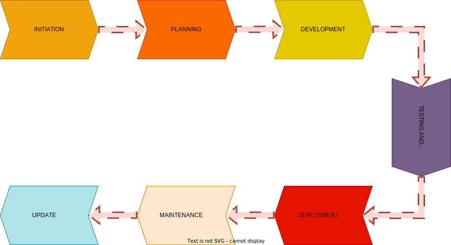
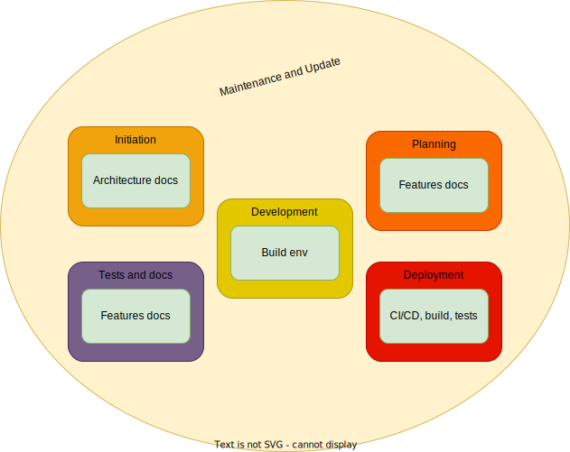
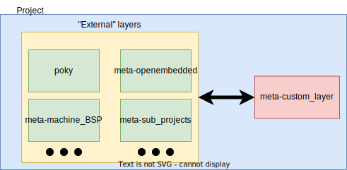
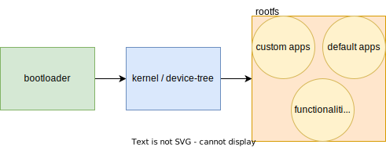

class: center, middle, intro

# Updates of Yocto-Based Projects: Effective strategies for ongoing maintenance

### Yocto DevDay 2023

## Tomasz Żyjewski


---
# `whoami`

.center[]

.center[Tomasz Żyjewski]
.center[_Embedded Systems Team Leader_]
.right-column50[
- over 4 years in 3mdeb
- integration of update systems and OS creation for embedded devices
- system security
]
.left-column50[
- <a href="https://twitter.com/tomzy_0"> @tomzy_0</a>
- <a href="mailto:tomasz.zyjewski@3mdeb.com"> tomasz.zyjewski@3mdeb.com</a>
]


---
# Who we are ?

.center[.image-15[] .image-15[] .image-15[] .image-15[]]
.center[.image-35[]]

* coreboot licensed service providers since 2016 and leadership participants
* UEFI Adopters since 2018
* Yocto Participants and Embedded Linux experts since 2019
* Official consultants for Linux Foundation fwupd/LVFS project since 2020
* IBM OpenPOWER Foundation members since 2020

---
# Agenda

* Project lifecycle
* Project components
* Update strategy
* Performing update
  - build environment
  - external layers update
  - custom layer update
* Build troubleshooting
  - bootloader
  - kernel
  - default applications
  - custom applications
* Veryfing update
* Summary

---
# Project lifecycle

.center[.image-99[]]

???

Let's explore the project lifecycle and emphasize the crucial role of updates.
The initiation phase involves gathering project ideas and requirements. In the
planning phase, we define the scope, objectives, and deliverables. During
development, we build and configure the Yocto-based project. Testing ensures the
project meets quality standards. In the deployment phase, we deploy the project
to the target system. However, it's important to note that updates play a vital
role in the maintenance phase. This phase involves ongoing support and updates
to address security vulnerabilities, minimize technical debt, and integrate new
functionalities. Updates are key to ensuring the project remains secure,
efficient, and up-to-date throughout its lifespan. By prioritizing updates, we
can maintain the project's health and adapt to evolving needs.

---
# Project components

* Architecture documentation
  - documentation describing architecture, software and hardware
  - interactions between them
* Features documentation
  - expected outcome of the given functionalities
* Build environment
  - good if setting up is automated
  - needs fullfill requirements of Yocto Project documentation
* Tests
  - covers all custom functionalities
  - good if fully automated
* CI/CD for build and tests
  - automates building and testing of the project
  - ensuring consistent and reliable results

???

Architecture documentation is a crucial component in updating Yocto-based
projects. It describes the system architecture, including software and hardware
components, as well as the interactions between them. This documentation
provides a comprehensive understanding of the system structure, which is
valuable when identifying areas for updates or improvements.

Features documentation plays a significant role in guiding updates. It provides
a description of the expected outcome of the given functionalities within the
project. This documentation helps prioritize updates based on project
requirements, ensuring that updates align with the desired goals of the system.

The build environment is an important component when it comes to updating
Yocto-based projects. An automated build environment is desirable as it improves
efficiency and consistency. The build environment should fulfill the
requirements specified in the Yocto Project documentation, ensuring
compatibility with the Yocto framework.

Tests are essential for validating the functionality of the project during
updates. It is crucial to have a comprehensive set of tests that cover all
custom functionalities within the project. Automating tests, if possible,
improves the frequency and reliability of testing, enabling faster and more
efficient updates.

Implementing CI/CD processes for build and tests is highly beneficial in
updating Yocto-based projects. CI/CD automation helps streamline the building
and testing of the project, reducing manual efforts and saving time. By
automating these processes, we ensure consistent and reliable results,
maintaining the integrity of the project throughout the update process.

---
# Project components

.center[.image-75[]]

???

Let's explore how the different project components align with the stages of the
project lifecycle we discussed earlier. During the initiation phase,
architecture documentation is created, providing a foundational understanding of
the system structure. This documentation becomes particularly valuable during
updates, helping us identify areas that may require modifications or
improvements.

Moving into the planning phase, features documentation is developed, outlining
the desired functionalities of the project. This documentation guides us in
prioritizing updates based on project requirements and ensures that our updates
align with the intended goals of the system.

As we progress into the development phase, the build environment is established.
It provides the necessary tools, configurations, and dependencies for building
and updating the project. Maintaining an up-to-date build environment is crucial
for efficient updates, ensuring compatibility with the latest Yocto releases.

During the testing phase, comprehensive tests are designed and implemented.
These tests validate the project's functionality and help us identify potential
regressions that may arise during updates. By conducting thorough tests, we can
ensure that the system remains stable and reliable after applying updates.

In the deployment phase, CI/CD processes come into play. These automated
workflows streamline the build and testing stages, making the deployment of
updates more efficient and reproducible. CI/CD ensures that updates are
integrated seamlessly into the system.

Finally, all of these project components, including architecture documentation,
features documentation, build environment, tests, and CI/CD, collectively
contribute to ongoing maintenance and updates. They form a cohesive framework
that supports the project throughout its lifecycle, enabling us to address
security vulnerabilities, minimize technical debt, and integrate new
functionalities as we maintain and update our Yocto-based projects.

---
# Update strategy

* Remember every element of the project during updates
  - each project component, such as architecture documentation, features
    documentation, build environment, tests, and CI/CD, plays a crucial role in
    the project's functionality and stability
  - updates must consider all components to ensure compatibility, minimize
    regressions, and maintain the overall integrity of the Yocto-based project
* Importance of the update deployment method
  - the update deployment method impacts the efficiency, scalability, and user
    experience of the Yocto-based project
  - having a dedicated update system allows for streamlined and controlled
    updates, minimizing downtime and reducing the need for manual intervention
  - evaluating the requirements and constraints of the project helps determine
    whether a dedicated update system is necessary or if reflashing devices is
    feasible

???

TBD notes

---
# Update strategy

* Yocto release cycle
 - updating based on the Yocto release cycle ensures access to the latest
   features, bug fixes, and security patches provided by the Yocto Project.
 - regularly synchronizing with the Yocto release cycle maintains a stable and
   up-to-date project, leveraging the community's collective efforts and
   expertise
* CVE checks and security reports
  - integrating CVE (Common Vulnerabilities and Exposures) checks into the Yocto
    build helps identify security vulnerabilities in the project's components
  - organizing updates based on security reports allows for timely patching and
    protection against known vulnerabilities
* Feature-set requirements
 - considering feature updates allows for tailored enhancements, ensuring the
   project meets evolving functional needs and remains competitive in the market

???

TBD notes
https://docs.yoctoproject.org/ref-manual/release-process.html

---
# Performing update

* Build environment
  - ensuring the build environment is up-to-date and compatible with the Yocto
    Project requirements
* External layers update
  - updating external layers used in the project to their latest versions
* Custom layer update
  - updating the custom layer(s) specific to the project, incorporating
    necessary changes and improvements
* Real-life examples
  - responsive multimedia casting device using RaspberryPi
  - Yocto BSP maintenance
  - secure gateway for IoT data transfer using i.MX6
  - full build automation in project using Rockchip RK3399

???

Now let's dive into the process of performing updates in Yocto-based projects.
This stage is crucial for integrating new features, addressing security
vulnerabilities, and ensuring the system remains up to date. We will discuss
three key aspects to consider during the update process.

First, the build environment needs to be reviewed and updated. It's important to
ensure that the build environment is up-to-date and meets the requirements
specified in the Yocto Project documentation. This ensures compatibility and a
smooth update process.

Next, we need to update the external layers used in the project. External layers
provide additional functionality and components to the Yocto-based project. It's
important to check for updates to these external layers and incorporate the
latest versions to benefit from bug fixes, security patches, and new features.

Finally, we have the custom layer update. Custom layers are specific to the
project and may contain project-specific modifications, configurations, or
recipes. During the update process, we need to review and update these custom
layers to incorporate necessary changes, improvements, or bug fixes. This
ensures that the project's customizations remain compatible and functional with
the updated system.

By addressing these three aspects—build environment, external layers, and custom
layer update—we can ensure a smooth and successful update process for
Yocto-based projects. Updating these components in a systematic manner reduces
the risk of compatibility issues, ensures the project remains up to date, and
allows for seamless integration of new functionalities and improvements.

---
# Performing update - build environment

* Verify the compatibility of the build environment with the desired Yocto
  Project release
  - see `Build Host Packages` in Mega Manual
  - use the correct release
* Prepare a reproducible build environment
  - ansible can be used to put together such an environment
  - another possibility is to prepare a containeraized image; e.g.
    [kas](https://github.com/siemens/kas),
    [imx-docker](https://github.com/nxp-imx/imx-docker),
    [yocto-docker](https://github.com/3mdeb/yocto-docker)
  - easier to distribute such an environment among colleagues
* Review and update the configuration files (`local.conf`, `bblayers.conf`) to
  reflect any changes or additions required for the update
  - see migration guides to check if any changes need to be applied
  - rethink the way build configuration files are stored

???

rethink the way build configuration files are stored - you may want to go back
to the version before an update

---
# Performing update - external layers update

.center[]

* Project consists of external and custom layers
  - this way, we follow the rule **Never modify the POKY layer. Never. Ever.**
  - any customizations goes into `meta-custom_layer`: we have full control on
    what and why was changed through `.bbappends`
* For `external`, we should pick Yocto release; specific commit hash
  - task for that should be short, e.g., when using NXP BSP as a base, we should
    follow hashes used in the given BSP release

???

Never modify the POKY layer. Never. Ever. - even expand it on other layers

---
# Performing update - custom layer update

* Most of the effort of performing updates should be implemented in custom
  layers
* We can list some of the basic tasks carried out when updating Yocto, which
  should be done in custom layers
  - updating `LAYERSERIES_COMPAT` variable
  - going through the bbappends files and verifying that they all still apply
    (whether they depended on a revised version of a recipe)
  - verification of custom patches for used packages; perhaps some of them were
    added in the upstream
  - syntax and variables verification
  - path verification for the keywords `require` and `include`
* Check the migration guides in case we encounter unexpected behavior
  - there is one per release
  - we may found there useful scripts, like one for override syntax change

---
# Build troubleshooting

* We can split up every operating system into couple pieces
.center[]
* Updating whole system, means that every part needs to work correctly (meaning,
  as expected, presented in requirements)
  - bootloader - configuration, environment variables, boot script,
    functionality, drivers, boot-time
  - kernel/device-tree - hardware description, configuration, drivers, boot-time
  - custom/default apps - configuration, compilation, installation
  - functionalities - testing, feedback, improvements
* Other than that, we may also need to update our tests suites and CI/CD
  pipelines

---
# Build troubleshooting

* In the following slides, we want to present some of the problems we have had
  to work on in the recent past
  - most of them consist of updating to Yocto Kirkstone release
  - our experience allows us to describe a wide range of problems that any Yocto
    developer may encounter when updating a custom system
* We will discuss the following problems
  - changes in bootloaders and kernels on i.MX based platforms
  - proper configuration of default apps provided to our systems
  - modifications to the source code of custom applications when updating
    systems that use Qt
  - fixing CI/CD pipelines after switching to new Yocto release
  - going through test suites to preserve functionalities checking

---
# Build troubleshooting - bootloader

* Problems with updating bootloader may consist of
  - correcting bootscript
  - properly rebasing custom drivers and defconfigs
  - Yocto recipe compilation, but should not be a big issue as long as we are
    able to compile it manually
* bootscript

.code-11px[
```bash
-       "scriptaddr=" __stringify(CONFIG_SYS_LOAD_ADDR) "\0" \
+       "scriptaddr=0x12000000\0" \
```]

* board configuration

```bash
-    #define BOOT_TARGET_DEVICES(func) \
-    func(MMC, mmc, 0) \
+    #define BOOT_TARGET_DEVICES(func) \
+    func(MMC, mmc, 1) \
```

---
# Build troubleshooting - bootloader

* defconfig I

.code-11px[```bash
- CONFIG_SPL_MMC_SUPPORT=y
- CONFIG_SPL_SERIAL_SUPPORT=y
+ CONFIG_SPL_MMC=y
+ CONFIG_SPL_SERIAL=y
```]

* defconfig II

.code-11px[```bash
+ CONFIG_SYS_MALLOC_F_LEN=0x10000
+ CONFIG_SPL_SYS_MALLOC_F_LEN=0x2000
```]

.code-11px[```bash
Before update:

u-boot=> bdinfo
(...)
Early malloc usage: 1fe0 / 2000

After update:

alloc space exhausted
(...)
u-boot=> bdinfo
(...)
Early malloc usage: 1fe0 / 2000
```]

---
# Build troubleshooting - kernel

* Similar situation as with bootloader
  - more often, device-tree may take place in making problems; we are using more
    peripherals from Linux side
  - as in bootloader, we may face some of the configurations going from board
    config into Kconfig files
  - Yocto recipe compilation, but it should not be a big issue as long as we are
    able to compile it manually

* defconfig

.code-14px[```bash
+ CONFIG_EXPERT=y
+ CONFIG_GPIO_SYSFS=y
```]

???

CONFIG_GPIO_SYSFS=y - enabling EXPERT in order to get the same config as before
an update

---
# Build troubleshooting - kernel

* device-tree I

.code-14px[```bash
+	assigned-clocks = <&clk IMX8MM_CLK_PCIE1_AUX>,
+			  <&clk IMX8MM_CLK_PCIE1_PHY>,
+			  <&clk IMX8MM_CLK_PCIE1_CTRL>;
+	assigned-clock-rates = <10000000>, <100000000>, <250000000>;
+	assigned-clock-parents = <&clk IMX8MM_SYS_PLL2_50M>,
+				 <&clk IMX8MM_SYS_PLL2_100M>,
+				 <&clk IMX8MM_SYS_PLL2_250M>;
```]

* device-tree II

.code-14px[```bash
&sai2 {
        pinctrl-names = "default";
        pinctrl-0 = <&pinctrl_sai2>;
        pinctrl-1 = <&pinctrl_codec_en>;
-       clocks = <&clk IMX8MM_CLK_SAI2_ROOT>;
        assigned-clocks = <&clk IMX8MM_CLK_SAI2>;
        assigned-clock-parents = <&clk IMX8MM_AUDIO_PLL1_OUT>;
        assigned-clock-rates = <24576000>;
        (...)
```]

???

Add `assigned-clocks`, `assigned-clock-rates` and
`assigned-clock-parents` nodes to `pcie0`.

mimics
https://gitlab.com/3mdeb/dave_eu/linux-imx/-/commit/0d5920e4c35d15a9999ee19bb0521f21158072a0
Specify the clock rate and parent of i.MX8MQ/MM PCIe clocks.

sai2 overwriting correctly setting clocks in other file which caused whole
platform hang while booting

---
# Build troubleshooting - default applications

* Default applications as a part of the created image
  - by default, we mean here part of systems to which we did not provide custom,
    Client's source code
  - issues here: configuration changes, compilation errors

* Configuration changes
  - missed or changed PACKAGECONFIG
  - custom `do_configure` functions

.code-14px[```bash
- PACKAGECONFIG += "ssl libssh2"
+ PACKAGECONFIG += "openssl libssh2"
```]

tensorflow https://github.com/nxp-imx/meta-imx/pull/16

---
# Build troubleshooting - default applications

* Compilation errors

.code-14px[```bash
/tmp/(...)/python/interpreter_wrapper/interpreter_wrapper_pybind11.cc
| /work/build-wayland/tmp/(...)/python/interpreter_wrapper/interpreter_wrapper_pybind11.cc:16:10:
    fatal error: pybind11/functional.h: No such file or
directory
| 16 | #include "pybind11/functional.h"
(...)
| In file included from /work/build-wayland/tmp/(...)/interpreter_wrapper.cc:15:
| /work/build-wayland/tmp/(...)/python/interpreter_wrapper/interpreter_wrapper.h:28:10:
    fatal error: Python.h: No such file or directory
| 28 | #include <Python.h>
| | ^~~~~~~~~~
| compilation terminated.
| ninja: build stopped: subcommand failed.
```]

---
# Build troubleshooting - custom applications

* Custom applications often are provided by our clients
  - they were compiled in some environment
  - we integrate them for given Yocto release
  - update may introduce problems (compilator flags, deprecated variables)
  - example: using app after Qt5 update to Qt6

.code-9px[```bash
| /build/tmp-glibc/(...)/git/libs/qmqtt_client/ecc/ecc_manager.cpp: At global scope:
| /build/tmp-glibc/(...)/git/libs/qmqtt_client/ecc/ecc_manager.cpp:42:13: warning: 'bool
    writePrivateKeyToFile(const QString&, EVP_PKEY*)' defined but not used [-Wunused-function]
|    42 | static bool writePrivateKeyToFile(const QString& fileName, EVP_PKEY* key)
|       |             ^~~~~~~~~~~~~~~~~~~~~
| make[2]: *** [Makefile:318: temp/ecc_manager.o] Error 1
| make[2]: Leaving directory '/build/tmp-glibc/(...)/build/libs/qmqtt_client'
| make[1]: *** [Makefile:47: sub-qmqtt_client-make_first-ordered] Error 2
| make[1]: Leaving directory '/build/tmp-glibc/(...)/build/libs'
| make: *** [Makefile:48: sub-libs-make_first-ordered] Error 2
| ERROR: oe_runmake failed
| WARNING: exit code 1 from a shell command.
ERROR: Task (/work/meta-abcd-app/recipes-qt/abcd-mqtt-proxy/abcd-mqtt-proxy_git.bb:do_compile)
    failed with exit code '1'
NOTE: Tasks Summary: Attempted 4630 tasks of which 4609 didn't need to be rerun and 1 failed.

Summary: 1 task failed:
  /work/meta-abcd-app/recipes-qt/abcd-mqtt-proxy/abcd-mqtt-proxy_git.bb:do_compile
```]

---
# Veryfing update

* Solving any build problems usually leads us to a bootable image
  - it is insufficient, many functionalities may not work as they should
* Documentation and testing are essential here
  - docs allow us to understand the expected behavior
  - test should cover every functionality and verify them
  - they also should fulfill agreed requirements
* This is where the most tedious work of updating begins
  - iterations of tests, patches, rebuilds, and retests
  - CI/CD pipeline helps a lot
* Tests suites also need updates
  - the test result was based on an erroneous assumption, which was changed with
    the update
  - logs changed behavior

---
# Veryfing update

* Examples of changes needed in tests, when we got different logs

.code-14px[```bash
-   path: /usr/bin/tensorflow-lite-2.4.0/examples
+   path: /usr/bin/tensorflow-lite-2.9.1/examples
```]

.code-14px[```bash
-   - "PCI bridge: Synopsys, Inc. DWC_usb3 (rev 01)"
+   - "PCI bridge: Synopsys, Inc. DWC_usb3 / PCIe bridge (rev 01)"
```]

* Change the way how output is achieved
  - logging level may be changed, so we need to run `dmesg`
  - other commands may no longer print anything to userspace

---
# Summary

* Performing Yocto metadata updates is a complex and multi-level problem
  - we presented the problems arising from the very fact of preparing a new
    version of the image
  - next big problem may be how to deploy our update
* Knowing each component that makes up a Yocto-based project makes it easier to
  perform upgrades
  - it is crucial to understand the tasks that an embedded device is supposed
    to perform and make sure that after the upgrade, it is still able to perform
    them
  - correctly prepared documentation, a set of tests, and a working CI/CD
    pipeline significantly facilitates the validation of the correctness of the
    update performed
* It is also essential to determine the timing of the update
  - worth using additional tools to control the state of your image and make
    decisions based on that (e.g. CVE checks)
  - decision can be made based on Yocto release cycle

---
# Contact us

We are open to cooperate and discuss

- <a href="mailto:contact@3mdeb.com"> contact@3mdeb.com</a>

- <a href="https://www.facebook.com/3mdeb"> facebook.com/3mdeb</a>

- <a href="https://twitter.com/3mdeb_com"> @3mdeb_com</a>

- <a href="https://www.linkedin.com/company/3mdeb"> linkedin.com/company/3mdeb</a>

- <a href="https://3mdeb.com">https://3mdeb.com</a>

- <a href="https://calendly.com/3mdeb/consulting-remote-meeting">Book a call</a>

- <a href="https://newsletter.3mdeb.com/subscription/PW6XnCeK6">Sign up for the newsletter</a>

Feel free to contact us if you believe we can help you in any way. We are
always open to cooperate and discuss.

---
# Resources

* https://docs.yoctoproject.org/ref-manual/release-process.html
* https://docs.yoctoproject.org/migration-guides/migration-3.4.html#override-syntax-changes
* https://docs.yoctoproject.org/migration-guides/release-notes-4.0.html
* https://github.com/nxp-imx/meta-imx/pull/16

---

<br>
<br>
<br>
## .center[Q&A]
